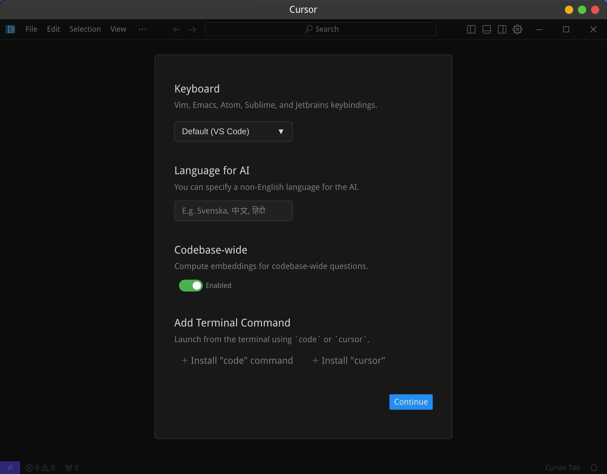
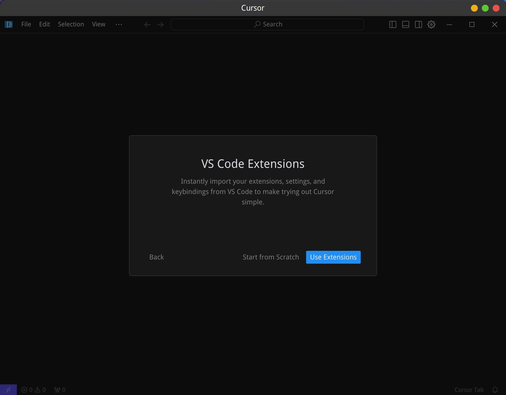
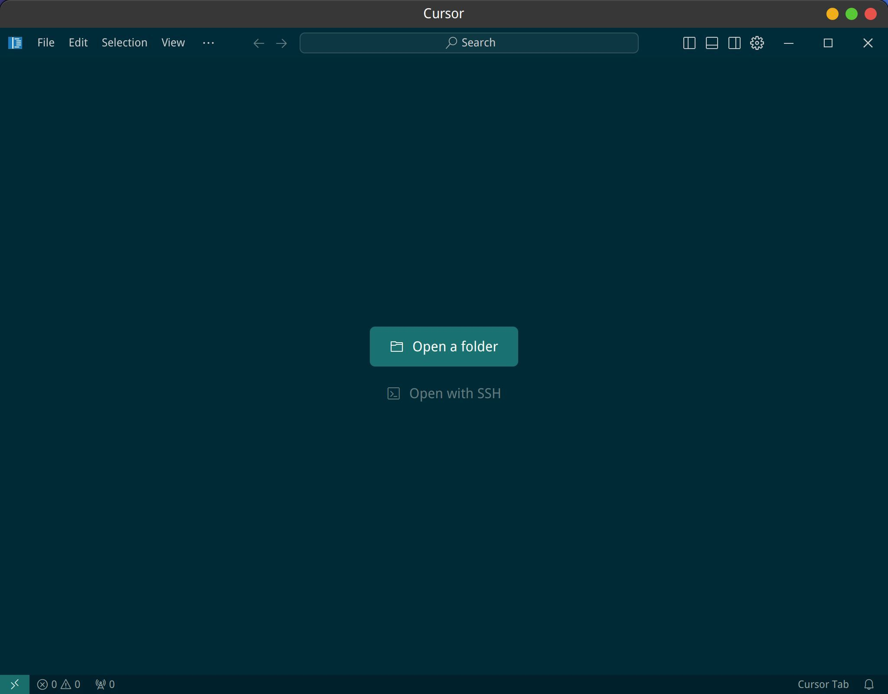

## 下载

下载 linux 的安装文件，会得到类似 `cursor-0.43.6-build-241206z7j6me2e2-x86_64.AppImage` 这样的文件。

## 安装

需要设置可执行权限，然后运行它进行安装：

```bash
chmod +x cursor-0.43.6-build-241206z7j6me2e2-x86_64.AppImage 

./cursor-0.43.6-build-241206z7j6me2e2-x86_64.AppImage      
```

安装界面：



"Add terminal command" 是用来从终端中启动，因为我同时还使用标准版本的vscode，因此我选择 "+ Install cursor"。但是很遗憾，报错。

配置 vs code 的 extension：



登录 cursor：


完成后打开的 cursor 界面：



发现其实没所谓安装过程，这个下载的文件就是应用启动文件。

因此转移到特定目录，方便以后使用:

```bash
mkdir ~/work/soft/cursor
mv cursor-0.43.6-build-241206z7j6me2e2-x86_64.AppImage ~/work/soft/cursor 
cd ~/work/soft/cursor   
mv cursor-0.43.6-build-241206z7j6me2e2-x86_64.AppImage cursor.AppImage                            
./cursor.AppImage 
```

但这个启动的方式，无法固定在面板，也无法固定在 dock，甚至 Synapse 都找不到它。

总不能每次都用终端启动吧？

google之后找到的方法是这样的

https://forum.cursor.com/t/how-to-open-cursor-from-terminal/3757/10

`ctrl + shift + p` 打开 Command Palette，然后运行 `Shell Command :Install Cursor command`。

但很遗憾，在 linux mint 22 （基于ubuntu24.04）下，找不到 `Shell Command :Install Cursor command`。看回帖有人也遇到和我一样的问题：


可以通过其他方法来解决这个问题：

```bash
vi ~/.zshrc
```

增加以下内容:

```bash
# cursor
cursor() {
  # Run the cursor command and suppress background process output completely
  (nohup ~/work/soft/cursor/cursor.AppImage "$@" >/dev/null 2>&1 &)
} 
```

重新载入：

```bash
source ~/.zshrc
```

之后在终端中输入 `cursor` 就可以启动 cursor 了，而且关闭这个终端也不会造成 cursor 进程退出。

