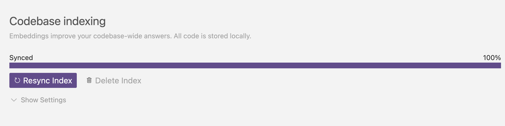

了解如何在Cursor中索引代码库，以获得更准确的AI帮助和搜索结果

## 索引代码库

为了获得更好和更准确的代码库答案，您可以索引您的代码库。在幕后，Cursor 为代码库中的每个文件计算嵌入，并将使用这些来提高代码库答案的准确性。

当项目被打开时，每个 Cursor 实例将初始化该工作空间的索引。初始索引设置完成后，Cursor 将自动为添加到您的工作区的任何新文件建立索引，以保持您的代码库上下文最新。

代码库索引的状态位于 `Cursor Settings` > `Features` > `Codebase Indexing` 。

## 高级设置

默认情况下，Cursor 将索引代码库中的所有文件。

您还可以展开 “Show Settings” 部分以访问更高级的选项。在这里，您可以决定是否要为新存储库启用自动索引，并配置 Cursor 在存储库索引期间将忽略的文件。

Cursor 使用与 VS Code 相同的包来处理文件忽略，这意味着它尊重所有 .gitignore 文件，包括子目录中的文件。您还可以为用户特定的忽略模式创建一个 .cursorignore 文件，您可能希望将其添加到 global.gitignore 中，以避免将其提交到存储库。

如果你的项目中有任何 AI 绝对不需要阅读的大型内容文件，忽略这些文件可以提高答案的准确性。

## 使用大型单体仓库

在处理包含数十万个文件的大型单体仓库时，重要的是要对索引的内容进行战略性的考虑。

- 使用 .cursorignore 让每个开发人员配置他们在单体仓库中工作的文件夹和路径

- 将 .cursorignore 添加到 global.gitignore

这允许每个开发人员在单体仓库中优化其特定工作区域的索引。

## FAQ
​
### 我在哪里可以看到我索引的所有代码库？

目前，没有办法看到你索引的所有代码库的列表。您需要手动检查每个项目的索引状态，方法是在 Cursor 中打开项目并检查 Codebase Indexing settings。

### 如何删除所有代码库？

您可以从 “设置” 中删除 cursor 帐户以删除所有已索引的代码库，也可以从每个项目的“代码库索引”设置中手动删除单个代码库。目前没有办法在不删除帐户的情况下一次性删除所有代码库。

