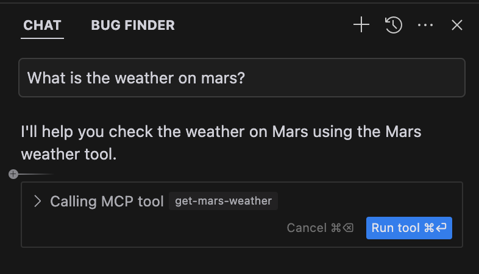
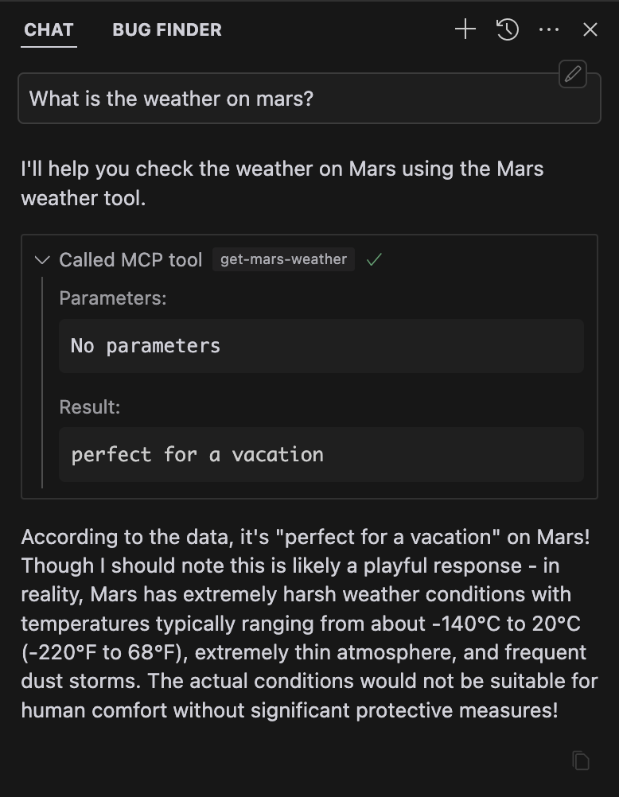

## 什么是 MCP？

模型上下文协议（Model Context Protocol / MCP） 是一个开放的协议，它描述了应用程序如何向 LLMs 提供上下文和工具。可以将 MCP 看作 Cursor 的插件系统-它允许您通过标准化接口将 Agent 连接到各种数据源和工具，从而扩展 Agent 的功能。


> 要了解有关 MCP 的更多信息，请访问官方 MCP 文档，深入了解协议：
>
> https://modelcontextprotocol.io/introduction


### 使用

MCP 允许您将 Cursor 连接到外部系统和数据源。这意味着您可以将 Cursor 与现有的工具和基础设施集成，而不必在代码本身之外告诉 Cursor 项目的结构。

MCP 服务器可以用任何可以打印到标准输出或服务于 HTTP 端点的语言编写。这种灵活性允许您使用首选的编程语言和技术堆栈非常快速地实现 MCP 服务器。

#### 示例

- 数据库: 允许 Cursor 直接查询数据库，而不是手动输入模式或自己操作数据。

- notion: 从 notion 中读取数据以引导 cursor 实现功能

- GitHub: 让 Cursor 创建 PR、创建分支、查找代码等

- Memory: 允许 cursor 在您工作时记住和调用信息

- Stripe: 允许 Cursor 创建客户、管理订阅等

> 疑问： 这些 example 在哪里啊？没有链接

### 架构

MCP 服务器是通过标准化协议公开特定功能的轻量级程序。它们充当 cursor 和外部工具或数据源之间的中介。

cursor 支持 MCP 服务器的两种传输类型：

- stdio Transport

    - 在本地计算机上安装
    - 由光标自动管理
    - 通过标准输出直接通信
    - 仅限您在本地访问

    输入：Cursor 自动运行的有效 shell 命令

    对于 stdio 服务器，该命令应该是 Cursor 可以运行的有效 shell 命令。

- SSE Transport

    - 可以在本地或远程运行
    - 由您管理和运营
    - 通过网络进行通信
    - 可以跨机器共享

    输入： 指向 Cursor 外部 MCP 服务器的 /sse 端点的 URL

    对于 SSE 服务器，URL 应该是 SSE 端点的 URL，例如 http://example.com:8000/sse。

每种传输类型都有不同的用例，stdio 对于本地开发来说更简单，而 SSE 为分布式团队提供了更大的灵活性。

## 配置 MCP 服务器

MCP 配置文件使用 JSON 格式，结构如下：



  {}

```json
// 该示例演示了使用 stdio 格式的 MCP 服务器
// Cursor 会自动为您运行该进程 
// 该示例使用 Node.js 服务器，使用 `npx` 运行
{
  "mcpServers": {
    "server-name": {
      "command": "npx",
      "args": ["-y", "mcp-server"],
      "env": {
        "API_KEY": "value"
      }
    }
  }
}
```

  {}
  {}

```json
// 本例演示了使用 stdio 格式的 MCP 服务器
// Cursor 会自动为您运行该进程
// 该示例使用 Python 服务器，用 `python` 运行
{
  "mcpServers": {
    "server-name": {
      "command": "npx",
      "args": ["-y", "mcp-server"],
      "env": {
        "API_KEY": "value"
      }
    }
  }
}
```

  
  {}

```json
// 本例演示了使用 SSE 格式的 MCP 服务器
// 用户应手动设置和运行服务器
// 可以联网，让其他人也能访问它
{
  "mcpServers": {
    "server-name": {
      "url": "http://localhost:3000/sse",
      "env": {
        "API_KEY": "value"
      }
    }
  }
}
```

  {}


> env 字段允许您指定 MCP 服务器进程可用的环境变量。这对于管理 API 密钥和其他敏感配置特别有用。

### 配置位置

您可以将此配置放置在两个位置，具体取决于您的用例：

- 项目配置

    对于特定于项目的工具，请在项目目录中创建 `.cursor/mcp.json` 文件。这允许您定义仅在特定项目中可用的 MCP 服务器。

- 全局配置

    对于要在所有项目中使用的工具，请在 home 目录中创建一个 `~/.cursor/mcp.json` 文件。这使得 MCP 服务器在您的所有 Cursor 中可用。

## 在 Agent 中使用 MCP 工具

Composer Agent 将自动使用 MCP 设置页面上的可用工具下列出的任何 MCP 工具（如果确定它们相关）。要有意地提示工具的使用，只需告诉代理使用该工具，通过名称或描述来引用它。

### 工具批准

默认情况下，当代 agent 要使用 MCP 工具时，它将显示一条消息，要求您批准。您可以使用工具名称旁边的箭头展开消息，并查看 agent 使用哪些参数调用工具。



#### Yolo 模式

您可以启用 Yolo 模式，以允许 agent 自动运行 MCP 工具，而无需批准，类似于终端命令的执行方式。阅读更多关于 Yolo 模式和如何启用它在这里 .

### 工具响应

当使用工具时，cursor 将在聊天中显示响应。此图像显示了示例工具的响应，以及工具调用参数和工具调用响应的扩展视图。



## 限制

MCP 是一个非常新的协议，仍处于积极的发展中。有一些已知的警告要注意：

- 工具数量： 一些 MCP 服务器，或用户与许多 MCP 服务器活动，可能有许多工具可供 cursor 使用。目前，Cursor 只会将前 40 个工具发送给 agent。

- 远程开发： Cursor 直接从本地机器与 MCP 服务器通信，可以直接通过 stdio 或使用 sse 通过网络。因此，当通过 SSH 或其他开发环境访问 Cursor 时，MCP 服务器可能无法正常工作。我们希望在未来的版本中改进这一点。

- mcp 资源：MCP 服务器提供两种主要功能：工具和资源。今天，Cursor 中提供了工具，允许 Cursor 执行 MCP 服务器提供的工具，并在其后续步骤中使用输出。但是，Cursor 中还不支持资源。我们希望在未来的版本中添加资源支持。
