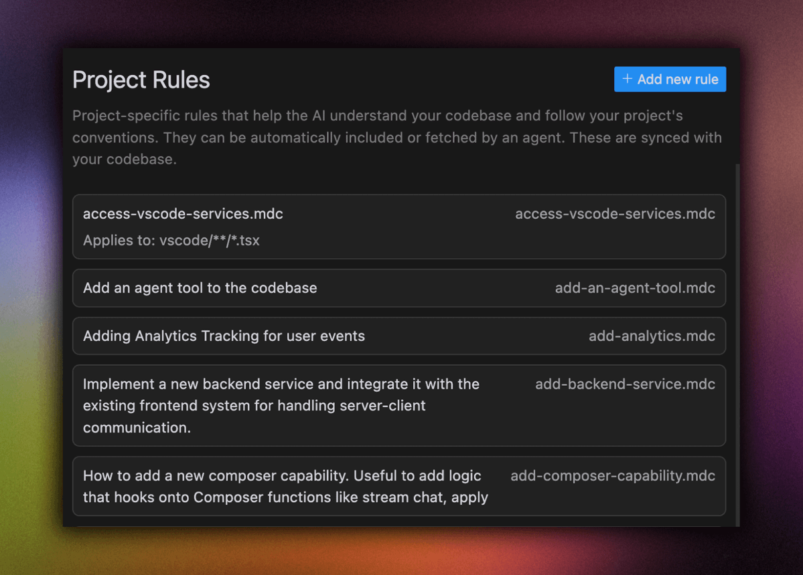
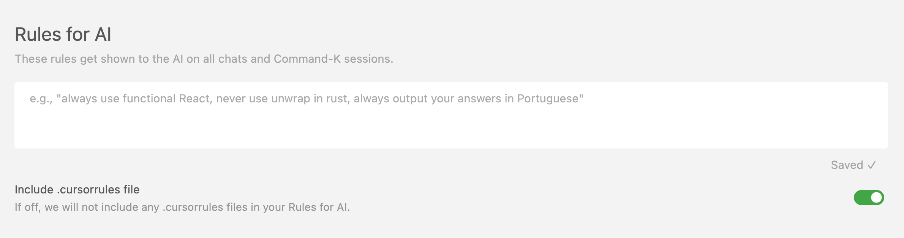

使用 Cursor 中的规则，您可以控制底层模型的行为。您可以将其视为指令和/或LLMs的系统提示。

在 Cursor 内部，我们有两种主要方法来定制 AI 的行为以满足您的需求：

- 项目规则：特定于项目的规则，存储在 `.cursor/rules` 目录中。当引用匹配的文件时，它们会自动包含在内。

- 全局规则: 规则全局应用于所有项目，在 Cursor Settings > General > Rules 部分中进行配置。

在以下部分中了解有关如何使用它们的更多信息。

## 项目规则（推荐）

项目规则提供了一个强大而灵活的系统，具有特定于路径的配置。项目规则存储在 `.cursor/rules` 目录中，并在项目的不同部分提供对 AI 行为的粒度控制。

它们是这样工作的

- 语义描述：每个规则都可以包括一个关于何时应用它的描述
- 文件模式匹配：使用 glob 模式指定规则适用于哪些文件/文件夹
- 自动附加：引用匹配文件时可以自动包含规则
- 以使用@file引用规则文件，允许您将多个规则链接在一起


您可以使用@file引用规则文件，允许您将多个规则链接在一起


您可以使用命令面板通过 ctrl + Shift + P > New Cursor Rule 创建新规则。通过使用项目规则，您还可以获得版本控制的好处，因为它只是一个文件

示例用例：

- 针对某些文件类型的特定于框架的规则（例如，.tsx 文件的 SolidJS 首选项）
- 自动生成文件的特殊处理（例如，.proto文件）
- 自定义UI开发模式
- 特定文件夹的代码样式和架构首选项
​
## 全局规则

全局规则可以通过修改 Cursor Settings > General > Rules for AI 下的 AI 规则部分来添加。如果你想指定每个项目都应该包含的规则，比如输出语言、响应长度等，这很有用。

​
## .cursorrules

为了向后兼容，您仍然可以在项目的根目录中使用 .cursorrules 文件。我们最终将在未来删除 .cursorrules，因此我们建议迁移到新的项目规则系统，以获得更好的灵活性和控制。

