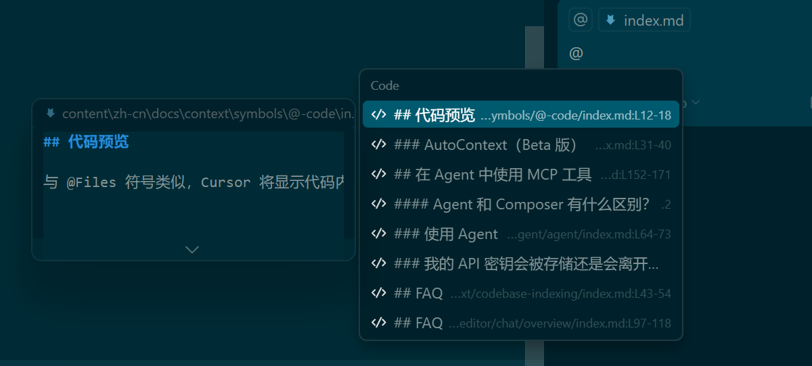

要引用特定的代码段，可以使用 @Code 符号。

## 代码预览

与 @Files 符号类似，Cursor 将显示代码内容的预览，以便您可以验证所引用的代码是否正确。

> 实操：有不好代码

## 从编辑器

另一种添加代码片段作为上下文的方法是选择要引用的代码，然后单击 “添加到聊天”（Ctrl/Shift L）或“添加到编辑”（Ctrl/Shift K）。

这将把选定的代码段添加到聊天输入框或当前活动的 Cmd K 提示栏中。

> 实操：还是这个方便。
