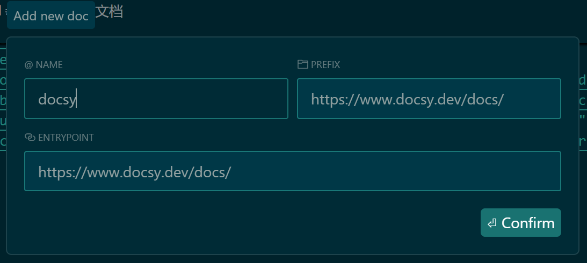
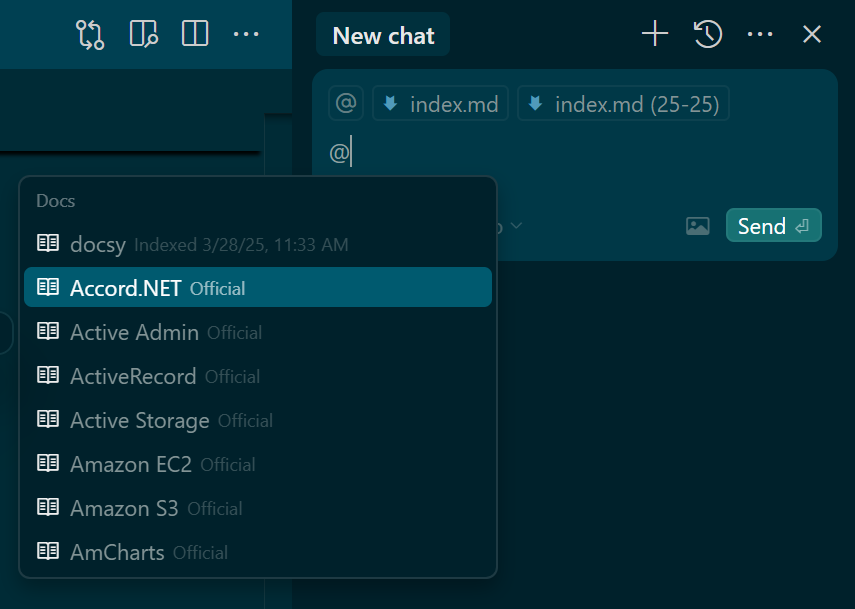

Cursor 附带了一组第三方文档，这些文档被抓取、索引并准备用作上下文。您可以使用 @ 符号访问它们。你可以在这里找到我们默认的预抓取文档列表。

### 附录：默认的预抓取文档列表

备注：cursor 的默认的预抓取文档列表

https://raw.githubusercontent.com/getcursor/crawler/main/docs.jsonl

内容如下：

```json
{  "name": "ASP.NET",  "crawlerStart": "https://learn.microsoft.com/en-us/aspnet/core/?view=aspnetcore-7.0",  "crawlerPrefix": "https://learn.microsoft.com/en-us/aspnet/core/"}
{  "name": "AWS Amplify",  "crawlerStart": "https://docs.amplify.aws/",  "crawlerPrefix": "https://docs.amplify.aws/"}
{  "name": "AWS CLI",  "crawlerStart": "https://docs.aws.amazon.com/cli/latest/reference/",  "crawlerPrefix": "https://docs.aws.amazon.com/cli/latest/reference/"}
{  "name": "AWS DynamoDB",  "crawlerStart": "https://docs.aws.amazon.com/dynamodb/",  "crawlerPrefix": "https://docs.aws.amazon.com/amazondynamodb/latest/developerguide/"}
{  "name": "AWS ECS",  "crawlerStart": "https://docs.aws.amazon.com/ecs/",  "crawlerPrefix": "https://docs.aws.amazon.com/ecs/latest/developerguide/"}
{  "name": "AWS Lambda",  "crawlerStart": "https://docs.aws.amazon.com/lambda/index.html",  "crawlerPrefix": "https://docs.aws.amazon.com/lambda/latest/dg/"}
{  "name": "AWS RDS",  "crawlerStart": "https://docs.aws.amazon.com/rds/",  "crawlerPrefix": "https://docs.aws.amazon.com/AmazonRDS/latest/UserGuide/"}
{  "name": "Amazon EC2",  "crawlerStart": "https://docs.aws.amazon.com/ec2/index.html",  "crawlerPrefix": "https://docs.aws.amazon.com/AWSEC2/latest/UserGuide/"}
{  "name": "Amazon S3",  "crawlerStart": "https://docs.aws.amazon.com/s3/index.html",  "crawlerPrefix": "https://docs.aws.amazon.com/AmazonS3/latest/userguide/"}
{  "name": "Android SDK",  "crawlerStart": "https://developer.android.com/docs",  "crawlerPrefix": "https://developer.android.com/"}
{  "name": "Angular",  "crawlerStart": "https://angular.dev/overview",  "crawlerPrefix": "https://angular.dev/"}
{  "name": "Ansible",  "crawlerStart": "https://docs.ansible.com/ansible/latest/index.html",  "crawlerPrefix": "https://docs.ansible.com/ansible/latest/"}
{  "name": "Ant Design",  "crawlerStart": "https://ant.design/docs/react/introduce",  "crawlerPrefix": "https://ant.design/docs/react/"}
{  "name": "Apache Airflow",  "crawlerStart": "https://airflow.apache.org/docs/apache-airflow/stable/index.html",  "crawlerPrefix": "https://airflow.apache.org/docs/apache-airflow/stable/"}
{  "name": "Apollo GraphQL",  "crawlerStart": "https://www.apollographql.com/docs/",  "crawlerPrefix": "https://www.apollographql.com/docs/"}
{  "name": "Apple Developer Documention",  "crawlerStart": "https://developer.apple.com/documentation/",  "crawlerPrefix": "https://developer.apple.com/documentation/"}
{  "name": "Astro",  "crawlerStart": "https://docs.astro.build/en/",  "crawlerPrefix": "https://docs.astro.build/en/"}
{  "name": "Auth0",  "crawlerStart": "https://auth0.com/docs",  "crawlerPrefix": "https://auth0.com/docs"}
{  "name": "Azure Pipelines",  "crawlerStart": "https://docs.microsoft.com/en-us/azure/devops/pipelines/?view=azure-devops",  "crawlerPrefix": "https://docs.microsoft.com/en-us/azure/devops/pipelines/"}
{  "name": "Bash",  "crawlerStart": "https://www.gnu.org/software/bash/manual/bash.html",  "crawlerPrefix": "https://www.gnu.org/software/bash/manual/"}
{  "name": "BeautifulSoup",  "crawlerStart": "https://www.crummy.com/software/BeautifulSoup/bs4/doc/",  "crawlerPrefix": "https://www.crummy.com/software/BeautifulSoup/bs4/doc/"}
{  "name": "Boto3",  "crawlerStart": "https://boto3.amazonaws.com/v1/documentation/api/latest/index.html",  "crawlerPrefix": "https://boto3.amazonaws.com/v1/documentation/api/latest/"}
{  "name": "Bun",  "crawlerStart": "https://bun.sh/docs",  "crawlerPrefix": "https://bun.sh/docs"}
{  "name": "C#",  "crawlerStart": "https://learn.microsoft.com/en-us/dotnet/csharp/",  "crawlerPrefix": "https://learn.microsoft.com/en-us/dotnet/csharp/"}
{  "name": "CSS",  "crawlerStart": "https://developer.mozilla.org/en-US/docs/Web/CSS",  "crawlerPrefix": "https://developer.mozilla.org/en-US/docs/Web/CSS"}
{  "name": "Cheerio",  "crawlerStart": "https://cheerio.js.org/docs/intro",  "crawlerPrefix": "https://cheerio.js.org/docs/"}
{  "name": "CircleCI",  "crawlerStart": "https://circleci.com/docs/",  "crawlerPrefix": "https://circleci.com/docs/"}
{  "name": "Clerk",  "crawlerStart": "https://clerk.com/docs",  "crawlerPrefix": "https://clerk.com/docs"}
{  "name": "Cloudflare",  "crawlerStart": "https://developers.cloudflare.com/",  "crawlerPrefix": "https://developers.cloudflare.com/"}
{  "name": "CodeMirror",  "crawlerStart": "https://codemirror.net/docs/",  "crawlerPrefix": "https://codemirror.net/docs/"}
{  "name": "Cursor",  "crawlerStart": "https://docs.cursor.com/",  "crawlerPrefix": "https://docs.cursor.com/"}
{  "name": "Cypress",  "crawlerStart": "https://docs.cypress.io/guides/overview/why-cypress",  "crawlerPrefix": "https://docs.cypress.io/guides/"}
{  "name": "D3",  "crawlerStart": "https://d3js.org/getting-started",  "crawlerPrefix": "https://d3js.org/"}
{  "name": "Datadog",  "crawlerStart": "https://docs.datadoghq.com/",  "crawlerPrefix": "https://docs.datadoghq.com/"}
{  "name": "Deno",  "crawlerStart": "https://deno.land/manual@v1.35.0/introduction",  "crawlerPrefix": "https://deno.land/manual@v1.35.0/"}
{  "name": "DigitalOcean",  "crawlerStart": "https://docs.digitalocean.com/",  "crawlerPrefix": "https://docs.digitalocean.com/"}
{  "name": "Discord API",  "crawlerStart": "https://discord.com/developers/docs/intro",  "crawlerPrefix": "https://discord.com/developers/docs"}
{  "name": "Django",  "crawlerStart": "https://docs.djangoproject.com/en/4.2/",  "crawlerPrefix": "https://docs.djangoproject.com/en/4.2/"}
{  "name": "Django Rest Framework",  "crawlerStart": "https://www.django-rest-framework.org/api-guide/requests/",  "crawlerPrefix": "https://www.django-rest-framework.org/api-guide"}
{  "name": "Docker",  "crawlerStart": "https://docs.docker.com/",  "crawlerPrefix": "https://docs.docker.com/"}
{  "name": "Drizzle",  "crawlerStart": "https://orm.drizzle.team/docs/overview",  "crawlerPrefix": "https://orm.drizzle.team/docs/overview"}
{  "name": "ELK Stack",  "crawlerStart": "https://www.elastic.co/guide/en/elastic-stack/current/index.html",  "crawlerPrefix": "https://www.elastic.co/guide/en/elastic-stack/current/"}
{  "name": "ESBuild",  "crawlerStart": "https://esbuild.github.io/api/",  "crawlerPrefix": "https://esbuild.github.io/api/"}
{  "name": "ESLint",  "crawlerStart": "https://eslint.org/docs/latest/",  "crawlerPrefix": "https://eslint.org/docs/latest/"}
{  "name": "Elasticsearch",  "crawlerStart": "https://www.elastic.co/guide/en/enterprise-search/current/index.html",  "crawlerPrefix": "https://www.elastic.co/guide/en/enterprise-search/current/"}
{  "name": "Electron",  "crawlerStart": "https://www.electronjs.org/docs/latest/",  "crawlerPrefix": "https://www.electronjs.org/docs/latest/"}
{  "name": "Emacs",  "crawlerStart": "https://www.gnu.org/software/emacs/manual/html_node/emacs/",  "crawlerPrefix": "https://www.gnu.org/software/emacs/manual/html_node/emacs/"}
{  "name": "Expo",  "crawlerStart": "https://docs.expo.dev/",  "crawlerPrefix": "https://docs.expo.dev/"}
{  "name": "Express",  "crawlerStart": "https://expressjs.com/en/5x/api.html",  "crawlerPrefix": "https://expressjs.com/en/5x/"}
{  "name": "FFmpeg",  "crawlerStart": "https://ffmpeg.org/ffmpeg.html",  "crawlerPrefix": "https://ffmpeg.org/ffmpeg.html"}
{  "name": "Fabric.js",  "crawlerStart": "http://fabricjs.com/docs/",  "crawlerPrefix": "http://fabricjs.com/docs/"}
{  "name": "FastAPI",  "crawlerStart": "https://fastapi.tiangolo.com/tutorial/",  "crawlerPrefix": "https://fastapi.tiangolo.com/tutorial/"}
{  "name": "Firebase",  "crawlerStart": "https://firebase.google.com/docs",  "crawlerPrefix": "https://firebase.google.com/docs"}
{  "name": "Flask",  "crawlerStart": "https://flask.palletsprojects.com/en/2.3.x/",  "crawlerPrefix": "https://flask.palletsprojects.com/en/2.3.x/"}
{  "name": "Flutter",  "crawlerStart": "https://docs.flutter.dev/",  "crawlerPrefix": "https://docs.flutter.dev/"}
{  "name": "FontAwesome",  "crawlerStart": "https://fontawesome.com/docs/web/",  "crawlerPrefix": "https://fontawesome.com/docs/web/"}
{  "name": "GCP CLI",  "crawlerStart": "https://cloud.google.com/sdk/docs",  "crawlerPrefix": "https://cloud.google.com/sdk/docs"}
{  "name": "Git",  "crawlerStart": "https://git-scm.com/docs",  "crawlerPrefix": "https://git-scm.com/docs"}
{  "name": "GitHub Actions",  "crawlerStart": "https://docs.github.com/en/actions",  "crawlerPrefix": "https://docs.github.com/en/actions"}
{  "name": "GitLab CI",  "crawlerStart": "https://docs.gitlab.com/ee/ci/",  "crawlerPrefix": "https://docs.gitlab.com/ee/ci/"}
{  "name": "Go",  "crawlerStart": "https://go.dev/doc",  "crawlerPrefix": "https://go.dev/doc"}
{  "name": "Godot",  "crawlerStart": "https://docs.godotengine.org/en/stable/",  "crawlerPrefix": "https://docs.godotengine.org/en/stable/"}
{  "name": "Google Maps JS API",  "crawlerStart": "https://developers.google.com/maps/documentation/javascript",  "crawlerPrefix": "https://developers.google.com/maps/documentation/javascript"}
{  "name": "Gradle",  "crawlerStart": "https://docs.gradle.org/current/userguide/userguide.html",  "crawlerPrefix": "https://docs.gradle.org/current/userguide/"}
{  "name": "Grafana",  "crawlerStart": "https://grafana.com/docs/grafana/latest/",  "crawlerPrefix": "https://grafana.com/docs/grafana/latest/"}
{  "name": "GraphQL",  "crawlerStart": "https://graphql.org/learn/",  "crawlerPrefix": "https://graphql.org/learn/"}
{  "name": "HTML",  "crawlerStart": "https://developer.mozilla.org/en-US/docs/Web/HTML",  "crawlerPrefix": "https://developer.mozilla.org/en-US/docs/Web/HTML"}
{  "name": "Heroku",  "crawlerStart": "https://devcenter.heroku.com/categories/reference",  "crawlerPrefix": "https://devcenter.heroku.com/"}
{  "name": "Insomnia",  "crawlerStart": "https://docs.insomnia.rest/",  "crawlerPrefix": "https://docs.insomnia.rest/"}
{  "name": "Ionic",  "crawlerStart": "https://ionicframework.com/docs",  "crawlerPrefix": "https://ionicframework.com/docs"}
{  "name": "JAX",  "crawlerStart": "https://jax.readthedocs.io/en/latest/",  "crawlerPrefix": "https://jax.readthedocs.io/"}
{  "name": "JUnit 5",  "crawlerStart": "https://junit.org/junit5/docs/current/user-guide/",  "crawlerPrefix": "https://junit.org/junit5/docs/current/user-guide/"}
{  "name": "Java",  "crawlerStart": "https://docs.oracle.com/javase/8/docs/api/",  "crawlerPrefix": "https://docs.oracle.com/javase/8/docs/api/"}
{  "name": "Jenkins",  "crawlerStart": "https://www.jenkins.io/doc/",  "crawlerPrefix": "https://www.jenkins.io/doc/"}
{  "name": "Jest",  "crawlerStart": "https://jestjs.io/docs/getting-started",  "crawlerPrefix": "https://jestjs.io/docs/getting-started"}
{  "name": "Jquery",  "crawlerStart": "https://api.jqueryui.com/1.12/",  "crawlerPrefix": "https://api.jqueryui.com/1.12/"}
{  "name": "Keras",  "crawlerStart": "https://keras.io/api/",  "crawlerPrefix": "https://keras.io/api/"}
{  "name": "Kubernetes",  "crawlerStart": "https://kubernetes.io/docs/",  "crawlerPrefix": "https://kubernetes.io/docs/"}
{  "name": "LLVM",  "crawlerStart": "https://llvm.org/docs/",  "crawlerPrefix": "https://llvm.org/docs/"}
{  "name": "Langchain",  "crawlerStart": "https://python.langchain.com/docs/",  "crawlerPrefix": "https://python.langchain.com/docs/"}
{  "name": "Langchain-JS",  "crawlerStart": "https://js.langchain.com/docs/",  "crawlerPrefix": "https://js.langchain.com/docs/"}
{  "name": "Laravel",  "crawlerStart": "https://laravel.com/docs/10.x",  "crawlerPrefix": "https://laravel.com/docs/10.x"}
{  "name": "Linux Man Pages",  "crawlerStart": "https://man7.org/linux/man-pages/dir_all_alphabetic.html",  "crawlerPrefix": "https://man7.org/linux/man-pages/"}
{  "name": "MCP",  "crawlerStart": "https://modelcontextprotocol.io/introduction",  "crawlerPrefix": "https://modelcontextprotocol.io/"}
{  "name": "MLX",  "crawlerStart": "https://ml-explore.github.io/mlx/build/html/",  "crawlerPrefix": "https://ml-explore.github.io/mlx/build/html/"}
{  "name": "Material UI",  "crawlerStart": "https://mui.com/material-ui/getting-started/",  "crawlerPrefix": "https://mui.com/material-ui/"}
{  "name": "Matplotlib",  "crawlerStart": "https://matplotlib.org/stable/api/",  "crawlerPrefix": "https://matplotlib.org/stable/api/"}
{  "name": "Maven",  "crawlerStart": "https://maven.apache.org/guides/",  "crawlerPrefix": "https://maven.apache.org/guides/"}
{  "name": "Microsoft Teams",  "crawlerStart": "https://learn.microsoft.com/en-us/microsoftteams/platform/",  "crawlerPrefix": "https://learn.microsoft.com/en-us/microsoftteams/platform/"}
{  "name": "Mockito",  "crawlerStart": "https://javadoc.io/doc/org.mockito/mockito-core/latest/index.html",  "crawlerPrefix": "https://javadoc.io/doc/org.mockito/mockito-core/latest/"}
{  "name": "MongoDB",  "crawlerStart": "https://www.mongodb.com/docs/manual/",  "crawlerPrefix": "https://www.mongodb.com/docs/manual/"}
{  "name": "MySQL",  "crawlerStart": "https://dev.mysql.com/doc/",  "crawlerPrefix": "https://dev.mysql.com/doc/"}
{  "name": "NLTK",  "crawlerStart": "https://www.nltk.org/",  "crawlerPrefix": "https://www.nltk.org/"}
{  "name": "Neo4j",  "crawlerStart": "https://neo4j.com/docs/",  "crawlerPrefix": "https://neo4j.com/docs/"}
{  "name": "NestJS",  "crawlerStart": "https://docs.nestjs.com/",  "crawlerPrefix": "https://docs.nestjs.com/"}
{  "name": "Netlify",  "crawlerStart": "https://docs.netlify.com/",  "crawlerPrefix": "https://docs.netlify.com/"}
{  "name": "NextJS",  "crawlerStart": "https://nextjs.org/docs",  "crawlerPrefix": "https://nextjs.org/docs"}
{  "name": "Nginx",  "crawlerStart": "http://nginx.org/en/docs/",  "crawlerPrefix": "http://nginx.org/en/docs/"}
{  "name": "NodeJS",  "crawlerStart": "https://nodejs.org/api/",  "crawlerPrefix": "https://nodejs.org/api/"}
{  "name": "Notion",  "crawlerStart": "https://developers.notion.com/reference/",  "crawlerPrefix": "https://developers.notion.com/reference/"}
{  "name": "NumPy",  "crawlerStart": "https://numpy.org/doc/stable/",  "crawlerPrefix": "https://numpy.org/doc/stable/"}
{  "name": "Nuxt",  "crawlerStart": "https://nuxt.com/docs",  "crawlerPrefix": "https://nuxt.com/docs"}
{  "name": "OpenAI",  "crawlerStart": "https://platform.openai.com/docs/",  "crawlerPrefix": "https://platform.openai.com/docs/"}
{  "name": "OpenCV",  "crawlerStart": "https://docs.opencv.org/4.x/",  "crawlerPrefix": "https://docs.opencv.org/4.x/"}
{  "name": "PHP",  "crawlerStart": "https://www.php.net/manual/en/",  "crawlerPrefix": "https://www.php.net/manual/en/"}
{  "name": "Pandas",  "crawlerStart": "https://pandas.pydata.org/docs/",  "crawlerPrefix": "https://pandas.pydata.org/docs/"}
{  "name": "Playwright",  "crawlerStart": "https://playwright.dev/docs/intro",  "crawlerPrefix": "https://playwright.dev/docs/"}
{  "name": "Pnpm",  "crawlerStart": "https://pnpm.io/",  "crawlerPrefix": "https://pnpm.io/"}
{  "name": "PostgreSQL",  "crawlerStart": "https://www.postgresql.org/docs/current/",  "crawlerPrefix": "https://www.postgresql.org/docs/current/"}
{  "name": "Postman",  "crawlerStart": "https://learning.postman.com/docs/",  "crawlerPrefix": "https://learning.postman.com/docs/"}
{  "name": "Prisma",  "crawlerStart": "https://www.prisma.io/docs",  "crawlerPrefix": "https://www.prisma.io/docs"}
{  "name": "Puppeteer",  "crawlerStart": "https://pptr.dev/",  "crawlerPrefix": "https://pptr.dev/"}
{  "name": "PyTorch",  "crawlerStart": "https://pytorch.org/docs/stable/",  "crawlerPrefix": "https://pytorch.org/docs/stable/"}
{  "name": "Python",  "crawlerStart": "https://docs.python.org/3/",  "crawlerPrefix": "https://docs.python.org/3/"}
{  "name": "ROS",  "crawlerStart": "https://docs.ros.org/en/rolling/",  "crawlerPrefix": "https://docs.ros.org/en/rolling/"}
{  "name": "Railway",  "crawlerStart": "https://docs.railway.app/",  "crawlerPrefix": "https://docs.railway.app/"}
{  "name": "React",  "crawlerStart": "https://react.dev/reference/react",  "crawlerPrefix": "https://react.dev/reference/"}
{  "name": "Redis",  "crawlerStart": "https://redis.io/docs/",  "crawlerPrefix": "https://redis.io/docs/"}
{  "name": "Regex",  "crawlerStart": "https://www.regular-expressions.info/",  "crawlerPrefix": "https://www.regular-expressions.info/"}
{  "name": "Remix",  "crawlerStart": "https://remix.run/docs/en/main",  "crawlerPrefix": "https://remix.run/docs/"}
{  "name": "Ruby",  "crawlerStart": "https://docs.ruby-lang.org/en/master/",  "crawlerPrefix": "https://docs.ruby-lang.org/en/"}
{  "name": "Rust",  "crawlerStart": "https://doc.rust-lang.org/book/",  "crawlerPrefix": "https://doc.rust-lang.org/book/"}
{  "name": "Rust Stdlib",  "crawlerStart": "https://doc.rust-lang.org/std/",  "crawlerPrefix": "https://doc.rust-lang.org/std/"}
{  "name": "SQLite",  "crawlerStart": "https://www.sqlite.org/docs.html",  "crawlerPrefix": "https://www.sqlite.org/"}
{  "name": "Scikit-learn",  "crawlerStart": "https://scikit-learn.org/stable/",  "crawlerPrefix": "https://scikit-learn.org/stable/"}
{  "name": "Selenium",  "crawlerStart": "https://www.selenium.dev/documentation/",  "crawlerPrefix": "https://www.selenium.dev/documentation/"}
{  "name": "Sentry",  "crawlerStart": "https://docs.sentry.io/",  "crawlerPrefix": "https://docs.sentry.io/"}
{  "name": "Socket.io",  "crawlerStart": "https://socket.io/docs/v4/",  "crawlerPrefix": "https://socket.io/docs/v4/"}
{  "name": "Solidity",  "crawlerStart": "https://docs.soliditylang.org/en/latest/",  "crawlerPrefix": "https://docs.soliditylang.org/en/latest/"}
{  "name": "Spring",  "crawlerStart": "https://docs.spring.io/spring-framework/reference/",  "crawlerPrefix": "https://docs.spring.io/spring-framework/reference/"}
{  "name": "Stripe",  "crawlerStart": "https://stripe.com/docs",  "crawlerPrefix": "https://stripe.com/docs"}
{  "name": "Supabase",  "crawlerStart": "https://supabase.com/docs",  "crawlerPrefix": "https://supabase.com/docs"}
{  "name": "Svelte",  "crawlerStart": "https://svelte.dev/docs",  "crawlerPrefix": "https://svelte.dev/docs"}
{  "name": "Tailwind",  "crawlerStart": "https://tailwindcss.com/docs",  "crawlerPrefix": "https://tailwindcss.com/docs"}
{  "name": "Terraform",  "crawlerStart": "https://developer.hashicorp.com/terraform/docs",  "crawlerPrefix": "https://developer.hashicorp.com/terraform/docs"}
{  "name": "Three.js",  "crawlerStart": "https://threejs.org/docs/",  "crawlerPrefix": "https://threejs.org/docs/"}
{  "name": "Tinygrad",  "crawlerStart": "https://docs.tinygrad.org",  "crawlerPrefix": "https://docs.tinygrad.org"}
{  "name": "TypeScript",  "crawlerStart": "https://www.typescriptlang.org/docs/",  "crawlerPrefix": "https://www.typescriptlang.org/docs/"}
{  "name": "Unity",  "crawlerStart": "https://docs.unity3d.com/Manual/",  "crawlerPrefix": "https://docs.unity3d.com/Manual/"}
{  "name": "Unreal Engine",  "crawlerStart": "https://docs.unrealengine.com/5.0/en-US/",  "crawlerPrefix": "https://docs.unrealengine.com/5.0/en-US/"}
{  "name": "Vercel",  "crawlerStart": "https://vercel.com/docs",  "crawlerPrefix": "https://vercel.com/docs"}
{  "name": "Vim",  "crawlerStart": "https://vimhelp.org/",  "crawlerPrefix": "https://vimhelp.org/"}
{  "name": "Vite",  "crawlerStart": "https://vitejs.dev/guide/",  "crawlerPrefix": "https://vitejs.dev/guide/"}
{  "name": "Vitest",  "crawlerStart": "https://vitest.dev/guide/",  "crawlerPrefix": "https://vitest.dev/guide/"}
{  "name": "Vue",  "crawlerStart": "https://vuejs.org/guide/introduction.html",  "crawlerPrefix": "https://vuejs.org/guide/"}
{  "name": "Webpack",  "crawlerStart": "https://webpack.js.org/concepts/",  "crawlerPrefix": "https://webpack.js.org/concepts/"}
{  "name": "Zsh",  "crawlerStart": "https://zsh.sourceforge.io/Doc/",  "crawlerPrefix": "https://zsh.sourceforge.io/Doc/"}
{  "name": "help",  "crawlerStart": "https://docs.cursor.com/get-started/welcome",  "crawlerPrefix": "https://docs.cursor.com/"}
```

140 多个常用的文档。

## 添加自定义文档

如果您想抓取和索引尚未提供的自定义文档，您可以通过 @Docs > Add new doc 来完成。 

> 实操：调出菜单


在您粘贴所需文档的 URL 后，


将出现以下模式：



> 实操: confirm 之后会报错，因为 entrypoint 强制要求是一个以文件介绍的 url，而不是 `https://www.docsy.dev/docs/` 这种目录形式的 url。
>
> 在路径后面加入 index.html 之后，就可以正常抓取了。
>
> https://www.docsy.dev/docs/index.html

然后 Cursor 将索引并学习文档，您将能够像任何其他文档一样将其用作上下文。


如果要索引所有子页面和子目录，请确保在 URL 后面添加一个斜杠

> 实操：能看到索引的具体的页面


> 实操：通过 @Docs 调出



## 管理自定义缓存

在 Cursor Settings > Features > Docs 下，您将看到您添加的文档。您可以在此处编辑、删除或添加新文档。