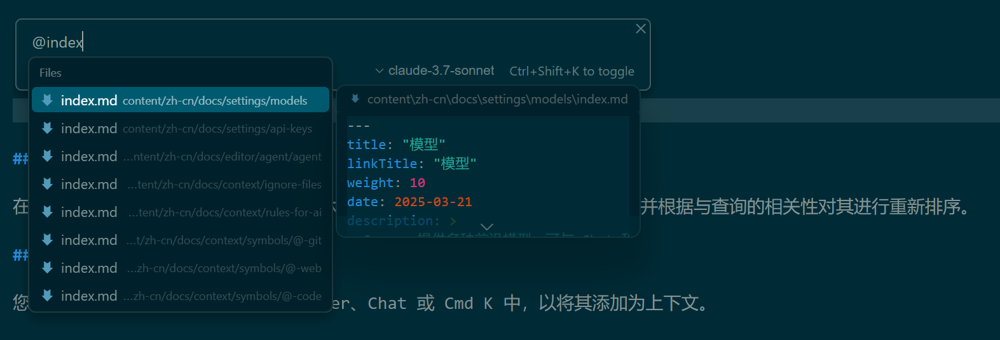

在人工智能输入框中，如 Chat 和 Cmd K，您可以通过使用 @Files 引用整个文件。此外，如果您继续在 @ 之后键入，您将在 @Code 策略之后看到文件搜索结果。

为了确保您引用的文件是正确的文件，光标将显示文件路径的预览。当您在不同的文件夹中有多个同名文件时，这尤其有用。

> 实操：同名文件太多时体验很差，还是拖放吧

## 聊天长文件引用

在 Cursor 的聊天中，如果文件的内容太长，Cursor 会将文件分成更小的块，并根据与查询的相关性对其进行重新排序。

## 拖放

您可以将文件从主侧边栏拖放到 Composer、Chat 或 Cmd K 中，以将其添加为上下文。

> 实操：这个比较简单方便，尤其是同名文件很多时