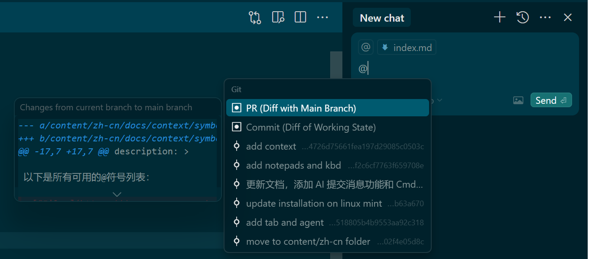
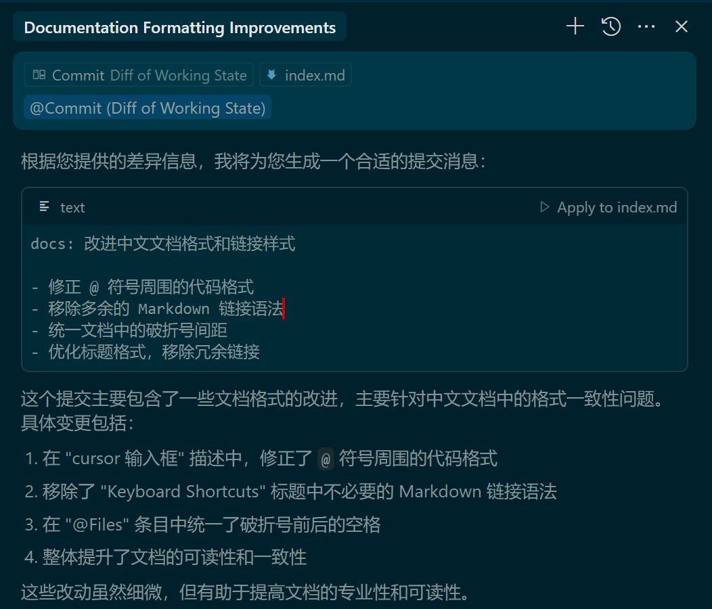

> 目前，@Git 仅在 Chat & Composer 中支持

在 Cursor 的 Chat 中，您可以使用 @Git 将 git commits、diffs 或 pull requests 添加到提示词中。

## 常见用例

@Git 的一个常见用例是允许 Cursor 的 AI 扫描差异并查找可能由差异引起的错误或问题。

您还可以使用 @Diff of Working State 从当前的差异生成提交消息。

> 实操: 生成的 commit message 还是很不错的，可以参考。

### 咨询 ai 得到的用法

我来为您解释 Cursor 中 @Git 的使用方法：

根据文档内容，@Git 是 Cursor 中一个强大的功能，目前仅在 Chat 和 Composer 中可用。以下是主要用途：

1. **代码差异分析**
   - 您可以使用 @Git 来分析代码的变更（diffs）
   - AI 可以帮助扫描这些变更，找出潜在的问题或 bug

2. **提交消息生成**
   - 使用 `@Diff of Working State` 命令可以基于当前的代码变更自动生成 git commit 消息

3. **代码审查**
   - 可以将 git commits、diffs 或 pull requests 添加到对话中
   - AI 可以帮助分析这些变更的影响

使用步骤：
1. 在 Cursor 的 Chat 界面中
2. 输入 @Git 或相关命令
3. 选择您想要分析的内容（比如某个 commit 或当前的代码变更）

这个功能特别适合：
- 代码审查时快速发现潜在问题
- 自动生成规范的提交信息
- 分析代码变更的影响范围

需要注意的是，目前这个功能仅限于 Chat 和 Composer 环境中使用。

如果您想了解更多具体的使用场景或详细信息，建议您尝试在 Cursor 中实际操作一下这些功能。
