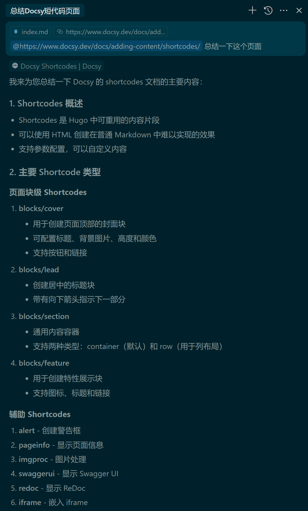
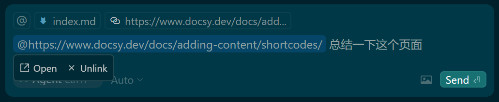

## 粘贴链接

为了让 cursor 在粘贴链接之前访问一个链接，你会看到这个链接是“标记”的。

> 实操：复制了一个链接 https://www.docsy.dev/docs/adding-content/shortcodes/ 到 chat 中，可以看到链接前面加了一个 @，我让它总结一下：

## 删除链接

默认情况下，我们会自动解析链接并将其转换为聊天中的 @Links 。如果您希望链接为纯文本，请单击链接，然后单击 “取消链接 ”。

> 实操：单击一下链接就有取消链接的 unlink 按钮了

您也可以不带格式地粘贴以确保链接未被标记。

> 实操：windows下是 control + Shift + v 无格式粘贴