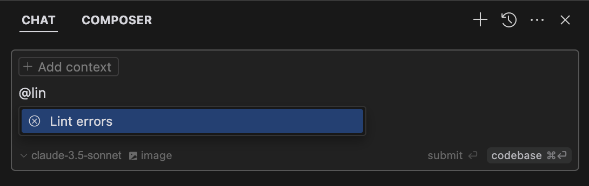

@Lint Errors 符号自动捕获并提供有关当前活动文件中的任何 lint 错误和警告的上下文。

默认情况下 ，Composer 和 Agent 可以看到 lint 错误：

## 咨询 cursor 给出的答复

让我帮您了解关于 @Lint Errors 的更多信息。我会先搜索相关代码来了解更多细节。

根据搜索结果，我来为您详细解释 Cursor 中的 @Lint Errors 功能：

@Lint Errors 是 Cursor 中的一个重要功能，主要用于：

1. **基本功能**

    - 自动捕获并提供当前活动文件中的任何 lint 错误和警告的上下文
    - 默认情况下，Composer 和 Agent 模式可以看到 lint 错误

2. **智能修复**

    - Cursor 让 AI 可以直接访问代码库中的 linter
    - 当检测到已安装的 Linter 标记的问题时，AI 可以智能地尝试自行修复这些问题
    - 这意味着您将始终获得干净、兼容的代码，而无需手动检查和修复任何问题

3. **使用场景**

    - 在编写代码时自动检测和修复代码规范问题
    - 在代码审查时快速发现潜在问题
    - 确保代码质量和一致性

4. **注意事项**

    - 某些语言（如 Rust）要求在 lint 错误出现之前保存文件，这可能会限制此功能在所有语言中的有效性
    - 该功能主要在 Chat 和 Composer 环境中使用

5. **与其他功能的集成**

    - 与 Tab 功能集成：Tab 可以根据您最近的更改和 linter 错误提出建议
    - 与 Agent 模式集成：Agent 可以自动检测和修复 lint 错误

这个功能是 Cursor 中代码质量控制的重要组成部分，可以帮助开发者保持代码质量，减少手动检查的工作量。
