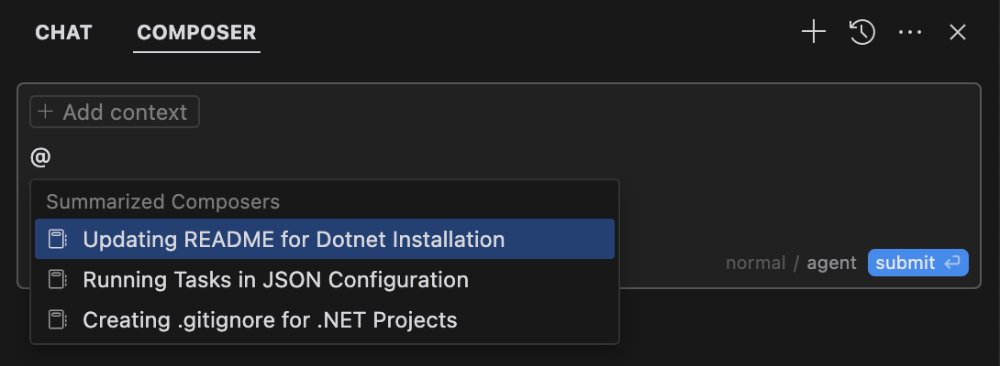

在 Composer 中处理复杂任务时，您可能希望引用上下文或以前对话中的决策。@Summarized Composers 符号允许您将以前 Composer 会话的摘要版本作为上下文包含在内。

这在以下情况下特别有用：

- 您有一个很长的 Composer 会话，其中包含要引用的重要上下文
- 你开始了一项新的但相关的任务，并希望保持连续性
- 你想分享上一次会议的推理或决定

## cursor 的解释

根据文件内容，我来为您解释 `@-summarized-composers` 符号的功能：

`@-summarized-composers` 是一个用于在 Cursor IDE 中引用历史 Composer 会话摘要的特殊符号。它的主要用途包括：

1. **上下文引用**：允许您在新的对话中引用之前 Composer 会话的摘要版本作为上下文。

2. **使用场景**：
   - 当您有一个很长的 Composer 会话，其中包含需要引用的重要上下文时
   - 当您开始一个新的但相关的任务，需要保持连续性时
   - 当您需要分享上一次会议的推理或决定时

3. **优势**：
   - 帮助保持对话的连续性
   - 避免重复之前的讨论
   - 方便引用历史决策和推理过程

这个功能对于处理复杂任务特别有用，因为它可以帮助您在不同会话之间保持上下文的连贯性，同时避免重复之前已经讨论过的内容。
