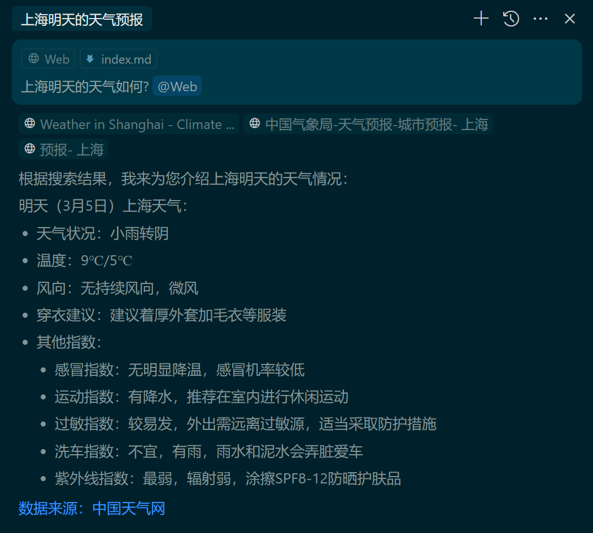

## @Web

使用 @Web，Cursor 根据查询和您提供的上下文构造搜索查询，并搜索 Web 以查找相关信息作为附加上下文。

这可能有助于 Cursor 在线查找最新信息，或者允许 Cursor 在几秒钟内抓取多个网站以找到最佳答案，而无需用户手动搜索任何地方。

> 实操：咨询明天的上海天气，给了最新的信息（2025-03-28号的天气信息），列出了三个网站。但很奇怪，答复中的明天写的是 2025-03-05，给的三个URL显示的28号的天气。

> 当使用 agent 模式时，Cursor 将在需要最新信息或其他上下文时自动搜索 Web。