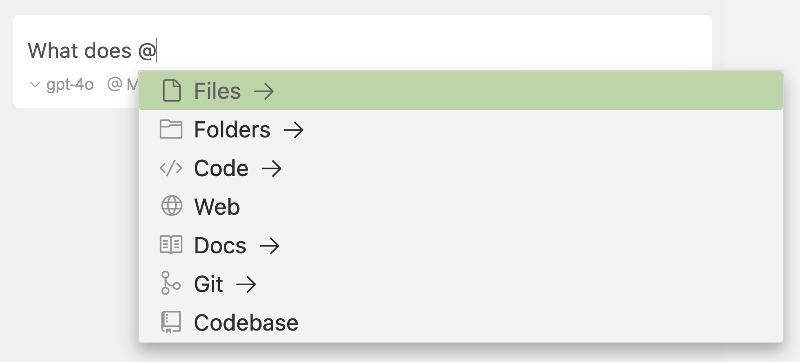

在 cursor 输入框中，例如 Composer、Chat 和 Cmd K中，您可以通过键入`@` 来使用 @符号。会弹出菜单显示建议列表，它将自动过滤，只显示根据您的输入最相关的建议。

## Keyboard Shortcuts 键盘快捷键

您可以使用上/下箭头键浏览建议列表。您可以按 `Enter` 键选择建议。如果建议是一个类别，如 `Files`，建议将被过滤，只显示该类别中最相关的项目。

以下是所有可用的@符号列表：

- [@Files](https://docs.cursor.com/context/@-symbols/@-files)-引用项目中的特定文件
- [@Folders](https://docs.cursor.com/context/@-symbols/@-folders) - 引用整个文件夹以获得更广泛的上下文
- [@Code](https://docs.cursor.com/context/@-symbols/@-code) - 引用代码库中的特定代码片段或符号
- [@Docs](https://docs.cursor.com/context/@-symbols/@-docs) - 访问文档和指南
- [@Git](https://docs.cursor.com/context/@-symbols/@-git) - 访问 git 历史和更改
- [@Notepads](https://docs.cursor.com/context/@-symbols/@-notepads) - 访问记事本
- [@Summarized Composers](https://docs.cursor.com/context/@-symbols/@-summarized-composers) - 使用摘要 composer 会话
- [@Cursor Rules](https://docs.cursor.com/context/@-symbols/@-cursor-rules) - 使用 cursor 规则
- [@Web](https://docs.cursor.com/context/@-symbols/@-web) - 应用外部 Web 资源和文档
- [@Link (paste)](https://docs.cursor.com/context/@-symbols/@-link) - 创建指向特定代码或文档的链接
- [@Recent Changes](https://docs.cursor.com/context/@-symbols/@-recent-changes) - 创建指向特定代码或文档的链接
- [@Codebase](https://docs.cursor.com/context/@-symbols/@-codebase) - 引用您的整个代码库作为上下文（仅[聊天](https://docs.cursor.com/chat/overview)）
- [@Lint Errors](https://docs.cursor.com/context/@-symbols/@-lint-errors) - 引用lint错误（仅[聊天](https://docs.cursor.com/chat/overview)）
- [@Definitions](https://docs.cursor.com/context/@-symbols/@-definitions) - 查找符号定义（仅限[Cmd K](https://docs.cursor.com/cmdk/overview)）还有一些其他符号可以使用：
- [# Files](https://docs.cursor.com/context/@-symbols/pill-files) - 将文件添加到上下文而不引用
- [/ Commands](https://docs.cursor.com/context/@-symbols/slash-commands) - 将打开的和活动的文件添加到上下文

