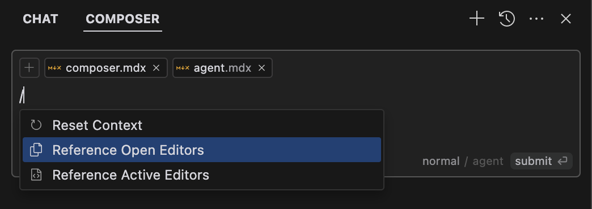
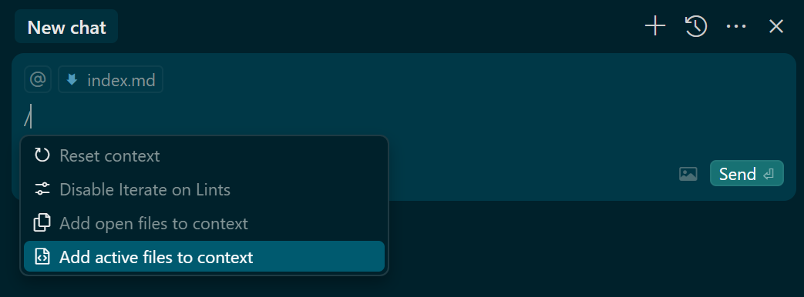

您可以键入 / 来快速引用打开的编辑器并将其添加为上下文

- 打开编辑器 ：当前打开所有编辑器选项卡
- 活动编辑器 ：视图中的所有编辑器选项卡。这通常发生在分割布局以显示多个编辑器时 

> 实操：菜单和文档有些小的出入

- "Add open files to context" : 是把所有打开的文件都添加到上下文
- "Add active files to context" : 是把当前视图中的文件添加到上下文
