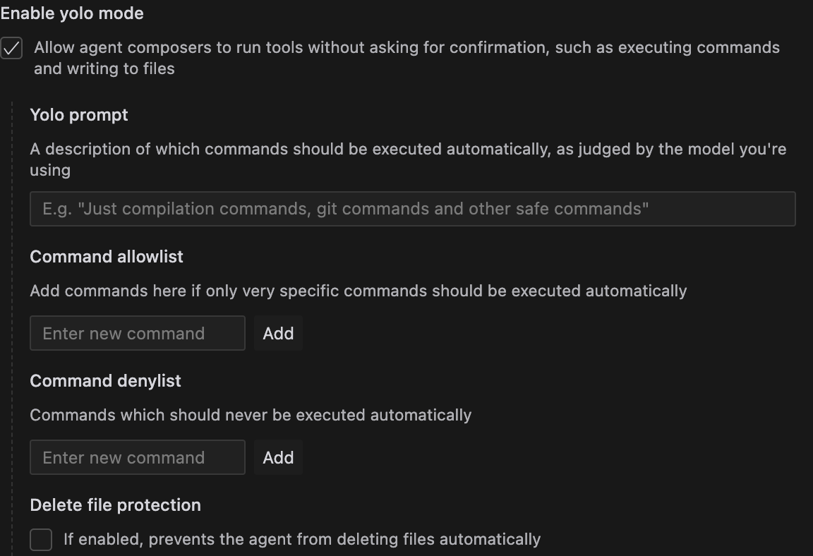

https://docs.cursor.com/agent

使用工具和推理来执行编码任务的 AI 助手，只需最少的监督

您可以将任务委托给 Cursor Agent，让它与您一起工作。Agent 在 Composer 中执行其工作，并构建在 Composer 之上。请确保阅读 Composer 以最好地使用Agent。

### 工具

Agent 可以访问多个工具，包括

- 阅读&写代码
- 搜索代码库
- 呼叫 MCP 服务器
- 运行终端命令
- 自动网络搜索最新信息

Agent 的推理能力使一些非常强大的工作流成为可能，它可以在没有太多监督的情况下执行许多连续的操作。在需要时，Agent将自动搜索Web以查找相关信息、文档或示例，以帮助您完成任务。

插入这个视频地址到当前 markdown 文件中，不要全屏

<video src="https://mintlify.s3.us-west-1.amazonaws.com/cursor/images/agent/agent-mcp-postgres.mp4" width="80%" height="80%" controls></video>

Agent 可以进行多达 25 次工具调用，然后停止。当达到限制时，您可以按“继续”让 Agent 进行更多工具调用（每次“继续”调用都算作一个请求）。

### Terminal/终端

当 agent 运行终端命令时，它使用 VS Code 的终端配置文件来确定要使用哪个 shell。它从默认配置文件开始，遍历可用的配置文件，并选择第一个支持命令检测的配置文件。这意味着如果先找到另一个兼容的终端配置文件，agent 使用的 shell 可能与默认系统 shell 不同。

要更改使用的终端配置文件，请执行以下操作：

1. 打开命令行（Cmd/Ctrl+Shift+P）
2. 搜索 “Terminal: Select Default Profile”
3. 选择您的首选终端配置文件

### Yolo模式

启用 Yolo 模式后，Agent 可以自己执行终端命令。这在运行测试套件时特别有用。向 Agent 指示任务以及如何验证更改（运行测试），它将继续执行，直到任务完成。

### Guardrails/护栏

您可以为不希望 agent 自动运行的某些命令定义护栏和允许/拒绝列表。这是从 Cursor Settings 完成的。

备注： 新版本的 cursor 中，yolo 模式被改名为 auto-run 模式，开启时会有一个警告：

### 规则

你可以用规则来指导 agent 。它们可以根据 glob 模式自动附加到任何 Agent 请求，或者 Agent 可以根据规则描述获取一个。

阅读有关如何 [使用规则](https://docs.cursor.com/context/rules-for-ai) 的更多信息

### 使用 Agent

首先打开一个新的 Composer 并启用 agent 模式。从那里，你可以给它指示要执行什么工作。

<video src="https://mintlify.s3.us-west-1.amazonaws.com/cursor/images/agent/agent-toggle.mp4" width="80%" height="80%" controls></video>

备注：切换 Composer 的模式必须要打开新的 session，不能在已经运行的 session 中切换模式。

备注2：最新版本的 cursor 中，直接就是 agent 模式，不需要切换。

### 模型

今天您可以使用 claude-3.5-sonnet，gpt-4 o 和 o3-mini与代理。我们将很快添加更多的模型！

### FAQ

#### Agent 和 Composer 有什么区别？

您可以在 Composer 中的 Normal 和 Agent 模式之间切换。主要的区别是 Agent 会更努力地思考，使用推理和工具来解决问题。普通模式（编辑）用于单轮编辑，而询问模式(Ask mode)则帮助您理解和探索代码。