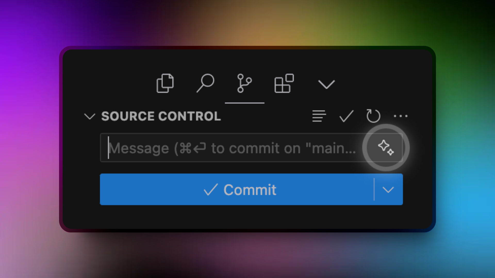

cursor 可以帮助您生成有意义的提交消息，您只需点击一下。以下是如何使用此功能：



1. 暂存要提交的文件
2. 打开边栏中的 Git 标签
3. 查找提交消息输入字段旁边的闪烁（sparkle）图标
4. 单击 sparkle 图标以根据您的暂存更改生成提交消息

生成的提交消息将基于暂存文件中的更改和仓库的 git 历史记录。这意味着 Cursor 将分析您当前的更改和以前的提交消息，以生成适合上下文的消息。游标从你的提交历史中学习，这意味着如果你使用像 Conventional Commits 这样的约定，生成的消息将遵循相同的模式。

## 快捷键

您可以将生成提交消息功能绑定到键盘快捷键。

1. 转到键盘快捷键 ctrl + R ctrl + S 或 ctrl + shift + P 并搜索“Open Keyboard Shortcuts (JSON)”
2. 将以下内容添加到文件中以绑定到 ctrl + m:

  ```json
  {
    "key": "cmd+m",
    "command": "cursor.generateGitCommitMessage"
  }
  ```

3. 保存文件


目前，还没有一种方法来定制或提供关于如何生成提交消息的特定说明。cursor 将自动适应您现有的提交消息样式。
