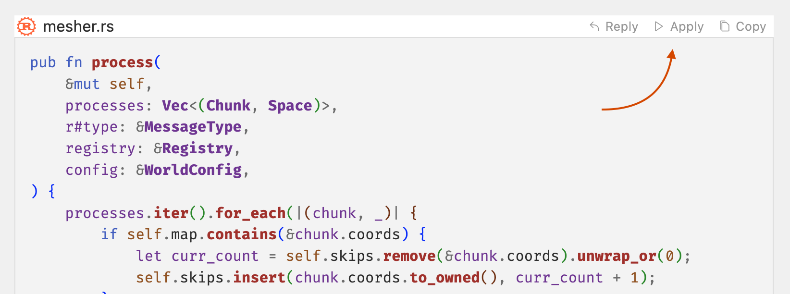
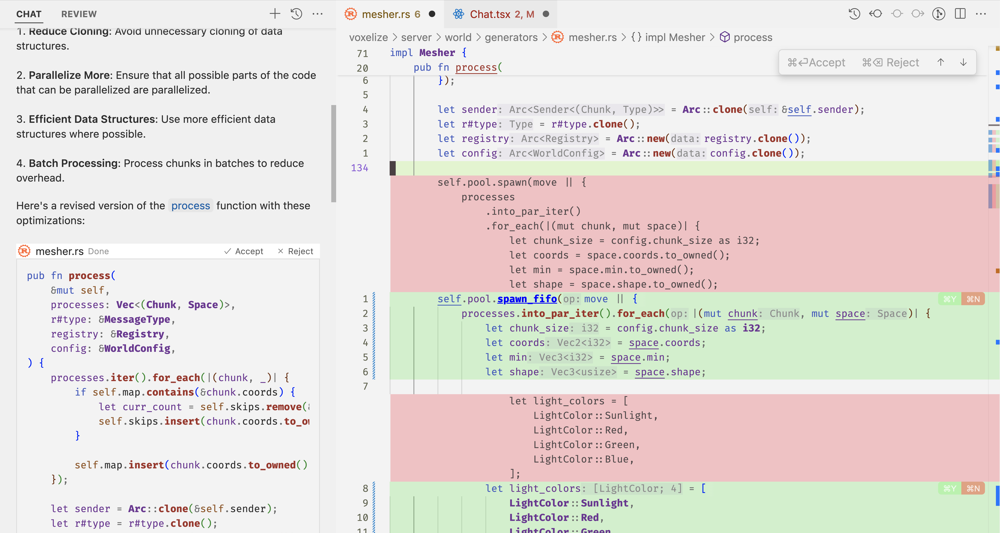

Cursor 的 Apply 允许您将 chat 中的代码块建议快速集成到代码中。

## 应用代码块

要应用代码块建议，您可以按每个聊天代码块右上角的 apply 按钮。

这将编辑您的文件，以包含 Chat 生成的代码。由于您可以在 Chat 中添加最多的上下文并与模型进行最多的来回操作，因此我们建议您使用 Chat + Apply 进行更复杂的 AI 驱动的代码更改。

## 接受或拒绝

一旦你应用了代码块，你就可以通过 diff 来接受或拒绝更改。您也可以点击聊天代码块右上角的 “Accept” 或 “Reject” 按钮。

Ctrl + Enter 表示接受，Ctrl + Backspace 表示拒绝。

