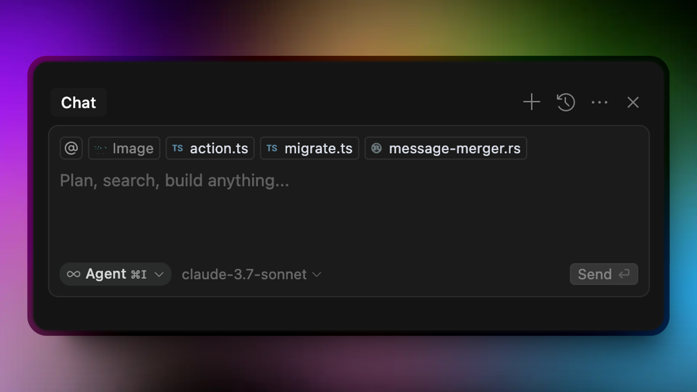
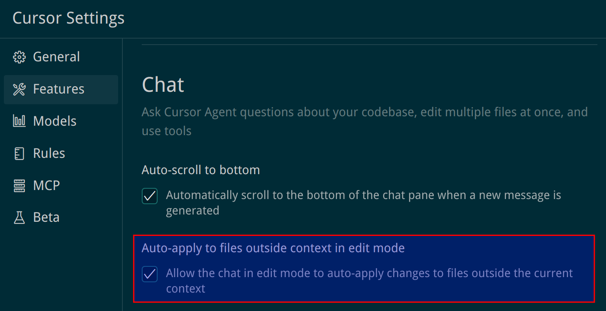
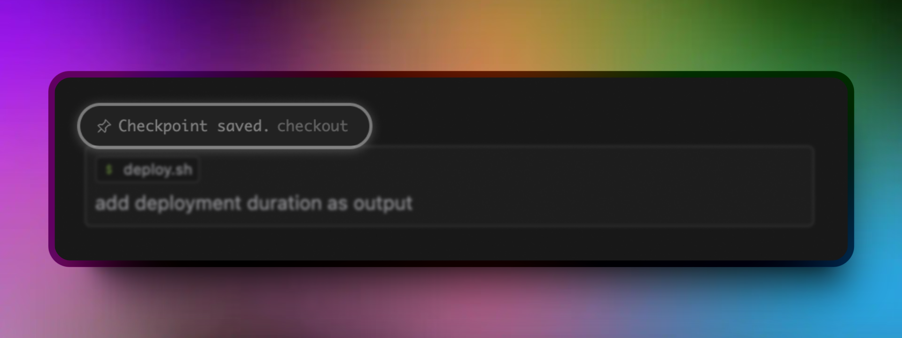
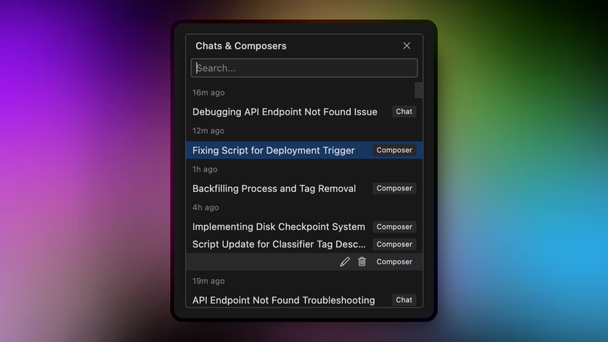
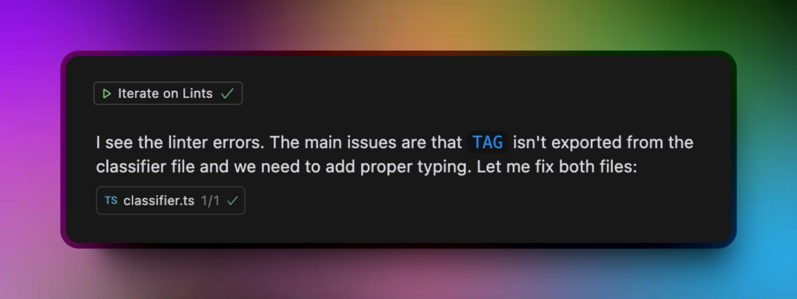

Cursor 的统一 AI 界面将不同的功能组合在一起，以帮助您直接在编辑器中编写、编辑和理解代码。使用 ctrl + I 打开它，并使用 ctrl + N 创建一个新的对话。使用输入框中的模式选择器在模式之间切换。

## 模式

该界面提供了三种模式，您可以从模式选择器中进行选择：

1. Agent 模式: 访问用于复杂任务的工具和推理功能。默认模式。
2. Edit 模式: 精确而清晰地对代码进行单次编辑。
3. Ask 模式: 询问有关您的代码的问题、获取解释并发现您的代码库。(ctrl + L)

您可以使用模式选择器或 ctrl + . 快捷方式在模式间切换。这种灵活性使您能够适应当前的需求-从提出问题到进行更改再到使用高级工具。

> 备注： 需要鼠标点在 chat 的输入框内，才能使用快捷键 ctrl + . 在模式间切换。

## 上下文

您可以使用 @ 符号在提示中包含相关上下文。该界面将根据您的查询自动建议相关上下文。

### AutoContext（Beta 版）

Cursor 可以使用嵌入和自定义模型在对话中自动包含相关代码。它不会使用 @ 符号手动选择上下文，而是分析您的提示并包含代码库（codebase）中最相关的代码。在 设置> 功能> 自动上下文中启用此功能。

 

备注：AutoContext 的设置应该是这个

  

## 生成和应用更改

Cursor 有一个内部训练的自定义模型，可以进行一系列编辑，正如您正在使用的 AI 模型所建议的那样，并在几秒钟内将其应用于具有 1000 行的文件。

这在“代理/Agent”和“编辑/Edit”模式下都会自动发生。

在 Ask 模式下，您可以通过单击 diff 视图右下角的 Apply 按钮来应用更改。

一旦你的更改完成，你可以在你的代码库中查看它们，然后选择接受或拒绝它们，如果你想进一步交互的话。

## 检查点

对于每个迭代，都会创建一个检查点。您可以通过单击该检查点附近的签出返回到任何以前的版本。如果您不喜欢当前的更改并希望恢复到以前的状态，这很方便。

## 聊天记录

通过历史记录访问之前的对话。从 cursor 选项卡右侧的历史记录图标打开它。您将看到一个过去的对话列表，您可以重新访问，重命名或删除。

> 备注：聊天历史记录的列表是没有删除/重命名的按钮的，要点击 show all，在弹出来的列表中才有删除/重命名的按钮。

当界面处于焦点状态时，使用 Ctrl + Alt +L 或 Ctrl+Alt+L 打开。

## 布局

- Pane ：侧边栏，左边是界面，右边是代码编辑器。
- Editor: 编辑器窗口，类似于正常查看代码。你可以移动它，分割它，甚至把它放在一个单独的窗口。

- Floating: 可拖动的窗口，您可以将其放置在您喜欢的位置

您可以从菜单> 打开为[布局]更改此设置

> 备注：居然找不到这个设置。

## 在 lint 上迭代

Cursor 让 AI 可以直接访问代码库中的 linter，这有助于它检查自己的代码以及项目中的现有代码。

当 Cursor 检测到已安装的 Linter 标记的问题时，AI 可以智能地尝试自行修复这些问题，并能够在需要时进行更改。

这意味着您将始终获得干净、兼容的代码，而无需手动检查和修复任何问题。


某些语言（如 Rust）要求在 lint 错误出现之前保存文件，这可能会限制此功能在所有语言中的有效性。


## 在编辑器中使用 AI

Cursor 的 AI 界面在编辑器中是可访问的，这意味着您可以随时使用它。

## FAQ

### 模式之间有什么区别？

Ask 模式可以帮助你理解和探索代码。使用它来提出问题，获得解释，并了解您的代码库。

Editor 模式侧重于对代码进行单次编辑。它提供了一个工作区，您可以在其中对文件进行精确更改。

Agent （默认）将这两种功能与额外的工具和推理能力相结合，以处理复杂的任务。

### 长时间的谈话是如何处理的？

对于长时间的对话，Cursor 使用较小的模型（如 cursor-small 和 gpt-4 o-mini） 总结早期的消息，以保持响应的快速性和相关性。

这种方法有助于确保即使是延长的对话也能保持响应性和连贯性，而不会丢失早期交流的关键细节。

### 我可以在另一台计算机上访问我的对话历史记录吗？

对话历史记录存储在您的本地计算机上，而不是存储在 Cursor 的服务器上或与您的 Cursor 帐户绑定。

这意味着如果您切换到其他计算机，您将无法访问以前的历史记录。您只能在最初创建历史记录的计算机上访问历史记录。
