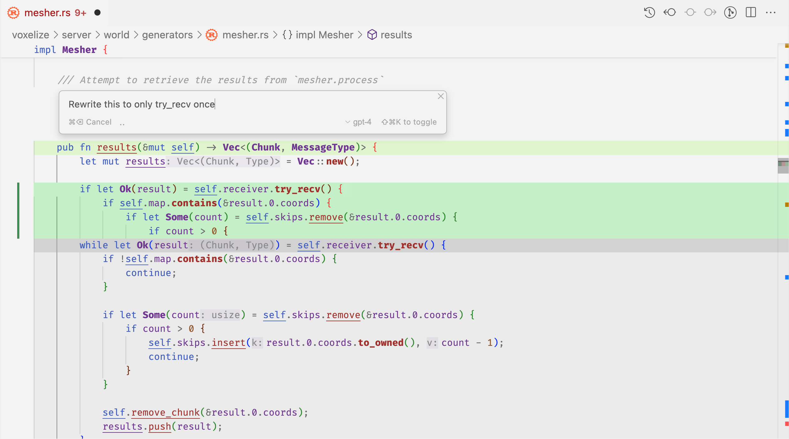

Cmd K，在 Windows/Linux 上也称为“Ctrl K”，允许您在编辑器窗口中生成新代码或编辑现有代码。

## 提示栏

在 Cursor 中，我们将按 Ctrl/Cmd K 时出现的栏称为“Prompt Bar”。它的工作原理类似于聊天的 AI 输入框，您可以正常输入，或使用 @ 符号引用其他上下文。

## Inline Generation/内连生成

如果按下 Ctrl/Cmd K 时没有选择任何代码，光标将根据您在提示栏中键入的提示生成新代码。

## in-place editing/原地编辑

对于原地编辑，只需选择要编辑的代码并在提示栏中键入即可。

## 后续说明

在每次生成之后，您可以通过向提示栏添加更多指令来进一步优化提示，然后按 Enter 键， 以便 AI 根据您的后续指令重新生成。

## 默认上下文

默认情况下，Cursor 将尝试查找不同类型的有用信息来改进代码生成，除了您包含的手动 @符号之外 。

其他上下文可能包括相关文件、最近查看的文件等。收集后，Cursor 根据与您的编辑/生成的相关性对上下文项进行排名，并将顶部项保留在大型语言模型的上下文中。

## 快速问答

如果您在提示栏中按 Option/Alt Enter，光标将回答您对选择的任何问题，以及您附加的上下文。

这个对话的内容可以在后续的生成中进一步使用，所以你可以在 Cursor 在一个快速的问题后给出一个响应来生成代码后，简单地输入“do it”。

