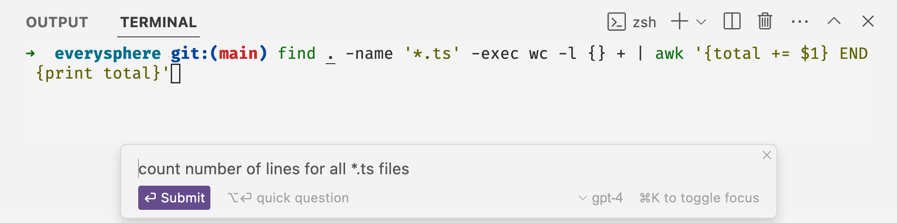
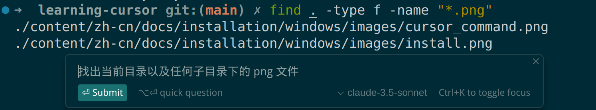

在内置的 cursor 终端中，您可以按 Ctrl + K 在终端底部打开一个提示栏。这个提示栏允许您在终端中描述您想要的操作，终端 Cmd K 将生成一个命令。您可以通过按 esc 来接受命令，也可以使用 Ctrl + Enter 立即运行命令。

默认情况下，Terminal Cmd K 会看到您最近的终端历史记录，您的指令以及您在提示栏中放置的任何其他内容。

> 备注：这个功能很好用啊，比如我想在终端中运行一个命令，但是我不记得命令的参数了，我就可以使用这个功能。
>
> 

