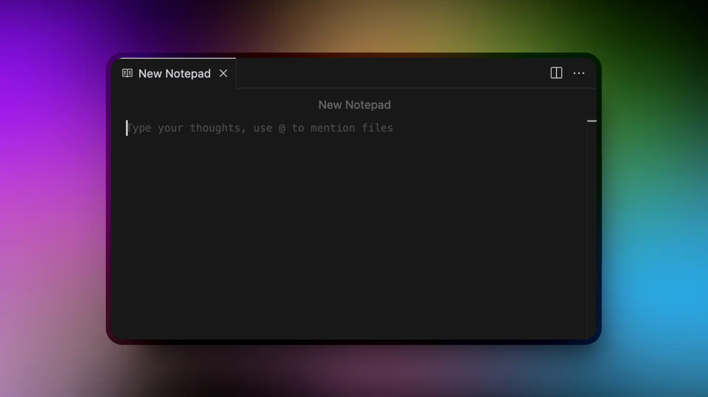
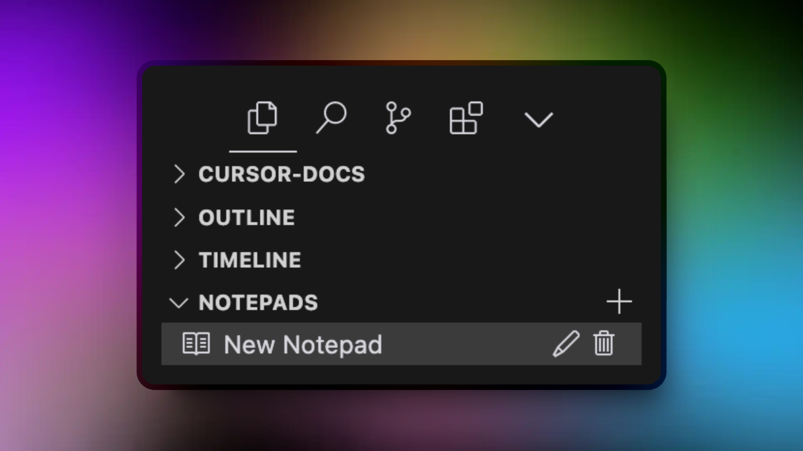


记事本目前处于测试阶段，将来可能会被弃用。


## 概述

记事本是 Cursor 中功能强大的上下文共享工具，可在 composer 和聊天交互之间弥补差距的桥梁。可以将它们看作是增强的参考文档，它超越了 .cursorrules 的功能，允许您为开发工作流创建可重用的上下文。



记事本是思想、规则和文档的集合，可以：

- 在开发环境的不同部分之间共享

- 使用 @ 语法引用

- 通过文件附件增强

- 用作各种开发方案的动态模板

## 入门

1. 单击记事本部分中的“+”按钮
2. 给你的记事本起一个有意义的名字
3. 添加您的内容，上下文，文件和其他相关信息，就像您在 composer 或聊天中一样。
4. 在 composers 中引用它或使用 @ 聊天



> 备注：需要手工打开 View -> Open View ，然后找到 notepads ，才能显示记事本面板

## 关键特性

- 上下文共享 ：在 composer 和聊天之间无障碍地共享上下文

- 附加文档和参考文件（在 .cursorrules 中不可能）

- 动态引用 ：使用 @mentions 链接到其他资源

- 灵活的内容 ：以适合您需求的方式编写和组织信息

## 常见用例

1. 动态样板生成

  - 为常见代码模式创建模板
  - 存储特定于项目的脚手架规则
  - 在整个团队中保持一致的代码结构

2. 架构文档

  - 前端规格
  - 后端设计模式
  - 数据模型文档
  - 系统架构指南

3. 研发指导方针

  - 编码标准
  - 项目特定规则
  - 最佳实践
  - 团队约定  

## FAQ

### 我应该在记事本中写什么？

记事本非常适合：

- 项目架构决策
- 发展准则和标准
- 可重用代码模板
- 需要经常引用的文档
- 特定于团队的惯例和规则

### 什么不应该写在记事本里？

避免使用记事本：

- 临时注释或临时工作
- 属于版本控制的信息（如 git）
- 敏感数据或凭据
- 经常变化的高度不稳定信息

### 我应该遵循特定的格式或结构吗？

虽然记事本很灵活，但我们建议：

- 使用清晰的标题和章节
- 包括相关的例子
- 保持内容的重点和组织
- 使用 markdown 格式以提高可读性
- 必要时添加相关文件附件

## 示例记事本

下面是一个用于 Web 应用程序项目的记事本的典型示例：

```markdown
# API Development Guidelines

## Endpoint Structure
- Use RESTful conventions
- Base URL: `/api/v1`
- Resource naming in plural form

## Authentication
- JWT-based authentication
- Token format: Bearer {token}
- Refresh token mechanism required

## Response Format
{
  "status": "success|error",
  "data": {},
  "message": "Optional message"
} 

## Attached References
@api-specs.yaml
@auth-flow.md
```