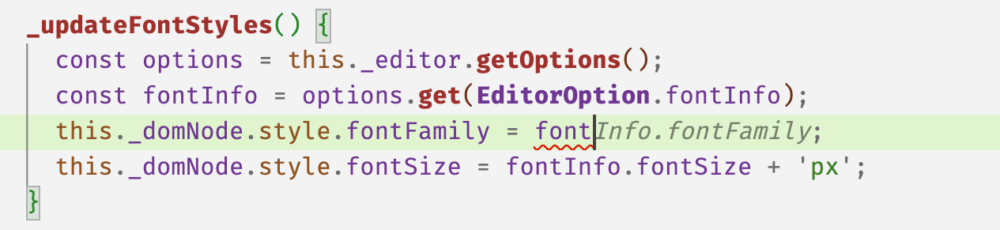

## 官方说明

https://docs.cursor.com/tab/overview

> AI-powered code autocomplete that suggests edits and multi-line changes based on your recent work
> 
> Cursor Tab is our native autocomplete feature. It’s a more powerful Copilot that suggests entire diffs with especially good memory.

AI 驱动的代码自动完成，根据您最近的工作建议编辑和多行更改。

Cursor Tab 是我们的原生自动完成功能。它是一个功能更强大的 Copilot，能建议整个差异，而且记忆力特别好。

> Powered by a custom model, Cursor Tab can:
> 
> - Suggest edits around your cursor, not just insertions of additional code.
> - Modify multiple lines at once.
> - Make suggestions based on your recent changes and linter errors.

由自定义模型提供支持，Cursor Tab 可以：

- 在光标周围进行建议编辑，而不仅仅是插入额外的代码。
- 一次修改多行。
- 根据您最近的更改和 linter 错误提出建议。

> Free users receive 2000 suggestions at no cost. Pro and Business plans receive unlimited suggestions.

免费用户可免费获得2000条建议。专业和商业计划会收到无限的建议。

### UI

> When Cursor is only adding additional text, completions will appear as grey text. If a suggestion modifies existing code, it will appear as a diff popup to the right of your current line.

当 Cursor 仅添加附加文本时，完成文本将显示为灰色文本。如果一个建议修改了现有的代码，它将在你当前行的右边显示为一个 diff 弹出窗口。

说明：就是显示建议内容时，如果只是在现有内容后面添加内容，则显示为灰色文本，如果修改了现有的代码，则不会就地显示，而是在这一行的后面弹出一个窗口。

> You can accept a suggestion by pressing Tab, or reject it by pressing Esc. To partially accept a suggestion word-by-word, press Ctrl/⌘ →. To reject a suggestion, just keep typing, or use Escape to cancel/hide the suggestion.

您可以按 Tab 键接受建议，也可以按 Esc 键拒绝建议。要逐字部分接受建议，请按 Ctrl/⌘ → (即 ctrl + 向右的方向键）。要拒绝建议，只需继续键入，或使用 Esc 取消/隐藏建议。

> Every keystroke or cursor movement, Cursor will attempt to make a suggestion based on your recent changes. However, Cursor will not always show a suggestion; sometimes the model has predicted that there’s no change to be made.

每一次鼠标或光标移动，Cursor都会尝试根据您最近的更改提出建议。然而，Cursor并不总是显示建议;有时模型已经预测到不需要进行任何更改。

> Cursor can make changes from one line above to two lines below your current line.

Cursor 可以从当前行的上一行到下两行进行更改。

### Toggling/切换

> To turn the feature on or off, hover over “Cursor Tab” icon on the status bar in the bottom right of the application.

要打开或关闭该功能，请将鼠标悬停在应用程序右下角状态栏上的 “Cursor Tab” 图标上。

### Keyboard Shortcut/键盘快捷键

> Bind Cursor Tab to a custom keyboard shortcut by selecting Settings > Keyboard Shortcuts from the Cursor menu and searching for Accept Cursor Tab Suggestions.

通过从 cursor 菜单中选择 设置 >键盘快捷键 并搜索 "接受光标选项卡建议"，将 Cursor Tab 绑定到自定义键盘快捷键。

