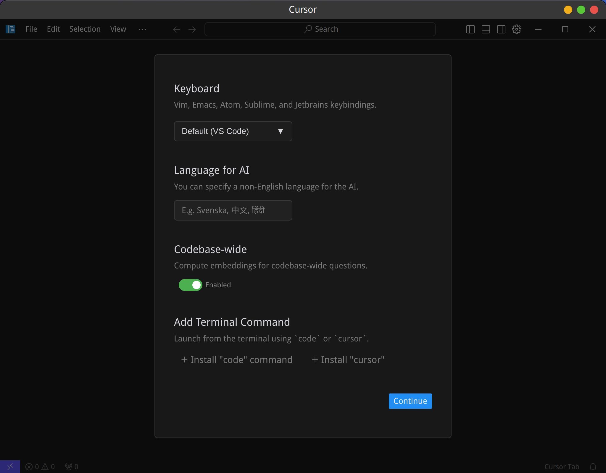
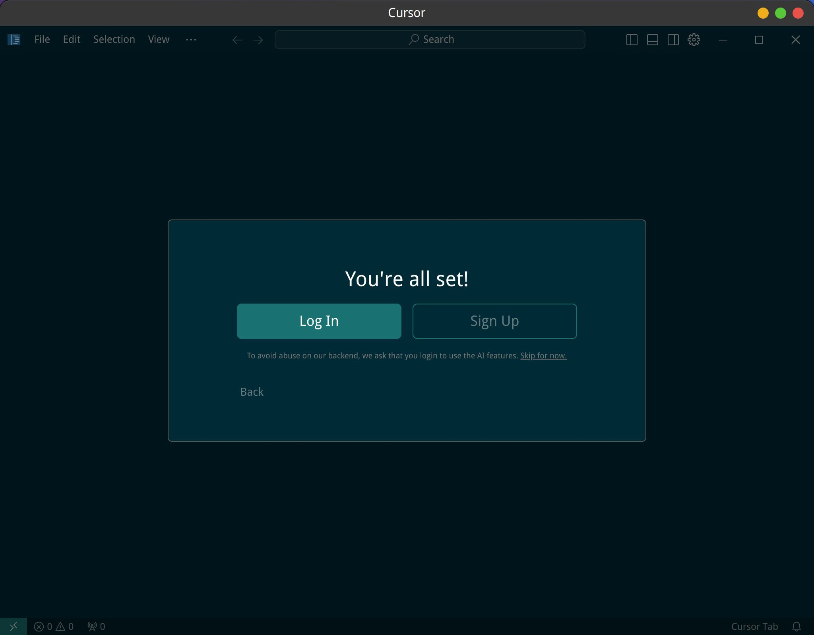
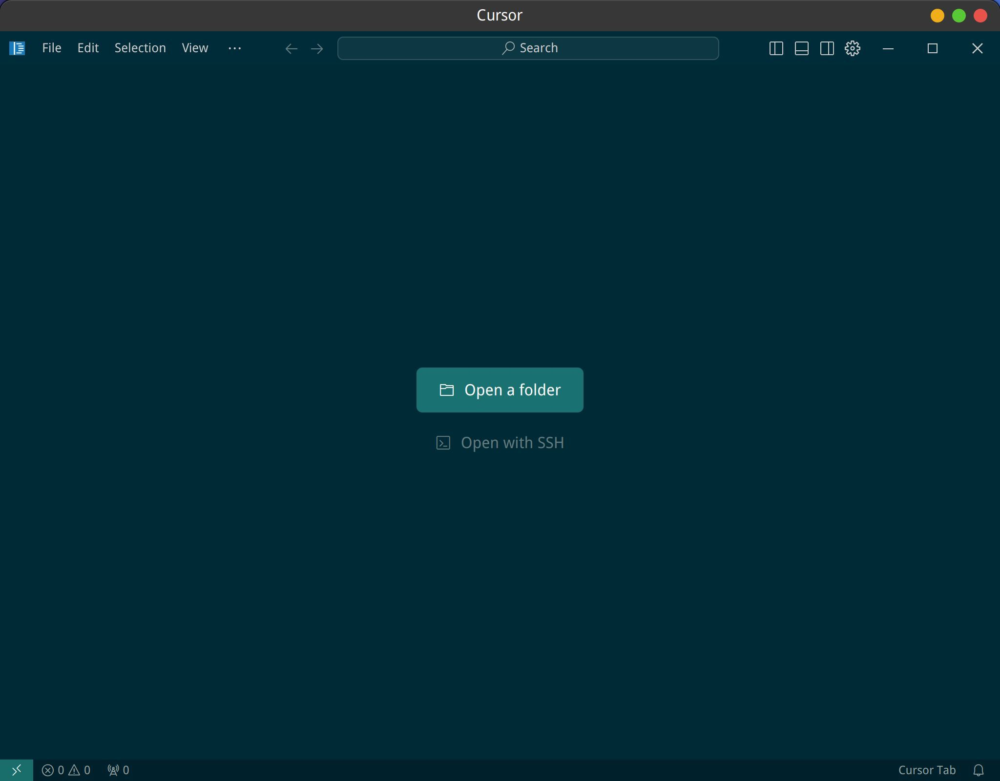
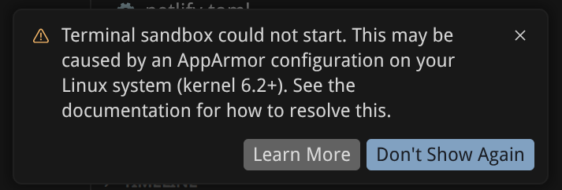

## 下载

下载 linux 的安装文件，会得到类似 `Cursor-0.47.8-82ef0f61c01d079d1b7e5ab04d88499d5af500e3.deb.glibc2.25-x86_64.AppImage` 这样的文件。

## 安装

需要设置可执行权限，然后运行它进行安装：

```bash
chmod +x Cursor-0.47.8-82ef0f61c01d079d1b7e5ab04d88499d5af500e3.deb.glibc2.25-x86_64.AppImage

./Cursor-0.47.8-82ef0f61c01d079d1b7e5ab04d88499d5af500e3.deb.glibc2.25-x86_64.AppImage      
```

安装界面：



"Add terminal command" 是用来从终端中启动，因为我同时还使用标准版本的vscode，因此我选择 "+ Install cursor"。但是很遗憾，报错。

配置 vs code 的 extension：


登录 cursor：



完成后打开的 cursor 界面：



发现其实没所谓安装过程，这个下载的文件就是应用启动文件。

因此转移到特定目录，方便以后使用:

```bash
mkdir -p ~/work/soft/cursor
mv Cursor-0.47.8-82ef0f61c01d079d1b7e5ab04d88499d5af500e3.deb.glibc2.25-x86_64.AppImage ~/work/soft/cursor/cursor.AppImage
cd ~/work/soft/cursor                               
./cursor.AppImage 
```

但这个启动的方式，无法固定在面板，也无法固定在 dock，甚至 Synapse 都找不到它。总不能每次都用终端启动吧？

## 启动

google 之后找到的方法是这样的:

https://forum.cursor.com/t/how-to-open-cursor-from-terminal/3757/10

`ctrl + shift + p` 打开 Command Palette，然后运行 `Shell Command :Install Cursor command`。

但很遗憾，在 linux mint 22 （基于ubuntu24.04）下，找不到 `Shell Command :Install Cursor command`。看回帖有人也遇到和我一样的问题：


### 命令行启动

可以通过其他方法来解决这个问题：

```bash
vi ~/.zshrc
```

增加以下内容:

```bash
# cursor
cursor() {
  # Run the cursor command and suppress background process output completely
  (nohup ~/work/soft/cursor/cursor.AppImage "$@" >/dev/null 2>&1 &)
} 
```

重新载入：

```bash
source ~/.zshrc
```

之后在终端中输入 `cursor` 就可以启动 cursor 了，而且关闭这个终端也不会造成 cursor 进程退出。

### 应用图标启动

从命令行启动终究有点麻烦，可以自己建立应用程序，然后点击启动 cursor。

从下列地址下载一个 cursor 的图标文件，放到 ` ~/work/soft/cursor/` 目录：

```bash
curl -o ~/work/soft/cursor/cursor-icon.svg https://www.cursor.com/favicon.svg
```

然后新建一个 cursor.desktop：

```bash
cd ~/.local/share/applications/

vi cursor.desktop
```

内容为：

```bash
[Desktop Entry]
Name=Cursor
Comment=start cursor
Exec=gnome-terminal -- bash -c "~/work/soft/cursor/cursor.AppImage;"
Icon=~/work/soft/cursor/cursor-icon.png
Terminal=false
Type=Application
Categories=Development;Application;
```

增加执行权限：  

```bash
chmod +x cursor.desktop
```

进入 `~/.local/share/applications/` 目录，双击 cursor 的图标就可以启动 cursor 了。

启动后，右键选择 "keep in Dock"，以后就可以从 Dock 直接启动了。

如果要增加桌面启动，复制这个 cursor.desktop 文件到桌面即可。

正常情况下，linux mint 默认的 Cinnamon Menu 应用启动器会识别到 `~/.local/share/applications/` 下的这个 cursor 应用，然后将其放置在开始菜单中的 Programming 分类中，从这里也可以打开 cursor。另外 Synapse 之类的应用程序启动器也可以识别到 cursor 了，alt + g 快捷键也可以方便的启动 cursor。


## 启动后报错

### Terminal sandbox count not start

启动后报错如下：



点击 Learn More 之后打开页面：

https://cursor.com/docs/agent/tools/terminal


```bash
cd ~/temp

curl -fsSL https://downloads.cursor.com/lab/enterprise/cursor-sandbox-apparmor_0.6.0_all.deb -o cursor-sandbox-apparmor.deb
sudo dpkg -i cursor-sandbox-apparmor.deb
```

或者直接下载 deb 文件后执行安装。安装完成之后重启 cursor 。但我重启之后，问题依旧，还是弹出同样的提示框。

参考如下文章：

https://www.zhihu.com/question/14311730226

#### 一次性手动修复

备份原有 profile:

```bash
sudo cp /etc/apparmor.d/cursor-sandbox /etc/apparmor.d/cursor-sandbox.bak
```

替换为完整的 cursor-sandbox profile:

```bash
sudo tee /etc/apparmor.d/cursor-sandbox > /dev/null << 'EOF'
profile cursor_sandbox /usr/share/cursor/resources/app/resources/helpers/cursorsandbox {
  file,
  /** ix,

  capability sys_admin,
  capability net_admin,
  capability chown,
  capability setuid,
  capability setgid,
  capability setpcap,
  capability dac_override,

  userns,
  mount,
  remount,
  umount,
  unix,
  network netlink raw,
  network unix,
  network inet stream,

  signal send peer=cursor_sandbox,
  signal receive peer=cursor_sandbox,

  /usr/share/cursor/resources/app/resources/helpers/cursorsandbox mr,
}

profile cursor_sandbox_remote /home/*/.cursor-server/bin/*/*/resources/helpers/{cursor-sandbox,cursorsandbox} {
  file,
  /** ix,

  capability sys_admin,
  capability net_admin,
  capability chown,
  capability setuid,
  capability setgid,
  capability setpcap,
  capability dac_override,

  userns,
  mount,
  remount,
  umount,
  unix,
  network netlink raw,
  network unix,
  network inet stream,

  signal send peer=cursor_sandbox,
  signal receive peer=cursor_sandbox,

  /home/*/.cursor-server/bin/*/*/resources/helpers/{cursor-sandbox,cursorsandbox} mr,
}
EOF
```

为 Cursor 主程序创建独立 profile

```bash
sudo tee /etc/apparmor.d/cursor > /dev/null << 'EOF'
abi <abi/4.0>,
include <tunables/global>

profile cursor /usr/share/cursor/cursor flags=(unconfined) {
  userns,
  include if exists <local/cursor>
}
EOF
```

重新加载 AppArmor profile: 

```bash
sudo apparmor_parser -r /etc/apparmor.d/cursor-sandbox
sudo apparmor_parser -r /etc/apparmor.d/cursor
```

锁定文件防止被覆盖:

```bash
sudo chattr +i /etc/apparmor.d/cursor-sandbox
```

注意：升级 Cursor 前需先解锁：sudo chattr -i /etc/apparmor.d/cursor-sandbox，升级后重新锁定。

#### 永久自动修复方案

保存修复版 profile 到安全位置:

```bash
sudo mkdir -p /etc/cursor-apparmor-fix
sudo cp /etc/apparmor.d/cursor-sandbox /etc/cursor-apparmor-fix/cursor-sandbox.fixed
```

创建修复脚本:

```bash
sudo tee /etc/cursor-apparmor-fix/apply-fix.sh > /dev/null << 'EOF'
#!/bin/bash
# 自动修复 Cursor AppArmor profile（每次 Cursor 升级后触发）

FIXED_PROFILE="/etc/cursor-apparmor-fix/cursor-sandbox.fixed"
TARGET="/etc/apparmor.d/cursor-sandbox"
LOG="/var/log/cursor-apparmor-fix.log"

echo "[$(date)] 开始应用 Cursor AppArmor 修复..." >> "$LOG"

chattr -i "$TARGET" 2>/dev/null
cp "$FIXED_PROFILE" "$TARGET"
chattr +i "$TARGET"

apparmor_parser -r "$TARGET" 2>> "$LOG" && \
  echo "[$(date)] cursor-sandbox profile 重载成功" >> "$LOG" || \
  echo "[$(date)] 警告：cursor-sandbox profile 重载失败" >> "$LOG"

if [ ! -f /etc/apparmor.d/cursor ]; then
  cat > /etc/apparmor.d/cursor << 'PROFILE'
abi <abi/4.0>,
include <tunables/global>

profile cursor /usr/share/cursor/cursor flags=(unconfined) {
  userns,
  include if exists <local/cursor>
}
PROFILE
  apparmor_parser -r /etc/apparmor.d/cursor 2>> "$LOG"
fi

echo "[$(date)] 修复完成" >> "$LOG"
EOF

sudo chmod +x /etc/cursor-apparmor-fix/apply-fix.sh
```

创建 dpkg 钩子:

```bash
sudo tee /etc/apt/apt.conf.d/99-cursor-apparmor-fix > /dev/null << 'EOF'
// 每次 cursor 包升级后自动重新应用 AppArmor 修复
DPkg::Post-Invoke {"if dpkg -l cursor 2>/dev/null | grep -q '^ii'; then /etc/cursor-apparmor-fix/apply-fix.sh; fi";};
EOF
```