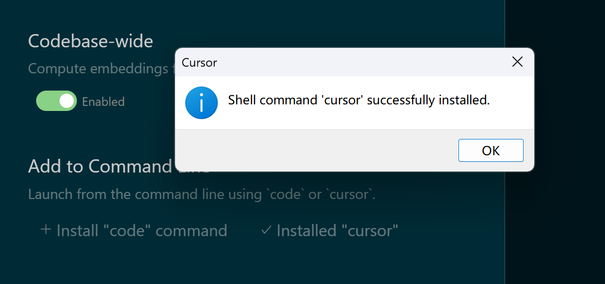
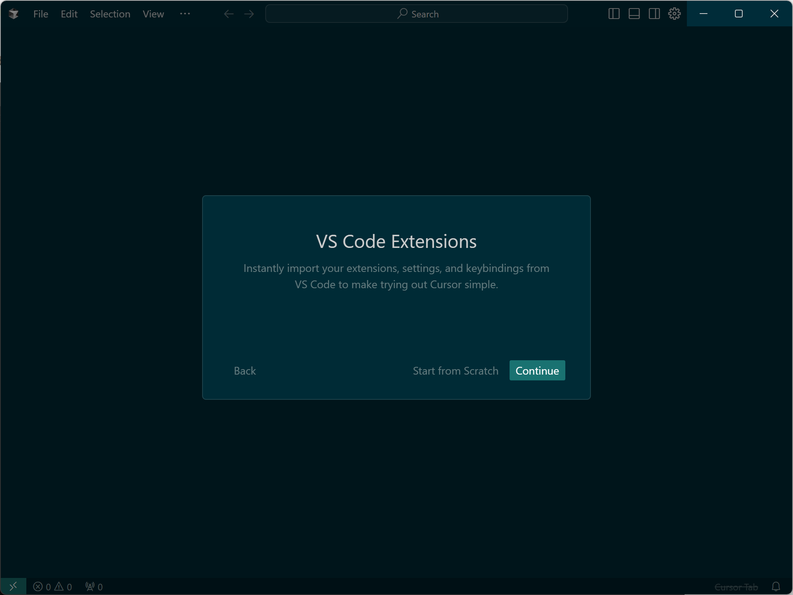
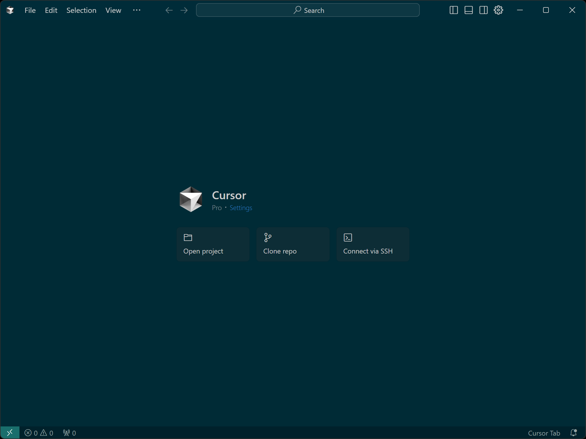

以 windows 11 ltsc 2024 为例。

## 下载

下载 windows 的安装文件，会得到类似 `Cursor Setup 0.45.14 - x64.exe` 这样的文件。

## 安装

运行它进行安装，安装界面：


"Add to command line" 是用来从命令行中启动，因为我同时还使用标准版本的vscode，因此我选择 "+ Install cursor"。



配置 vs code 的 extension：



资料收集：


登录 cursor：


完成后打开的 cursor 界面：



可以通过多种方式打开 cursor，比如在 cmd 或者 gitbash 里面输入 `cursor` 命令，实际是调用这个： 

```bash
$ which cursor
/d/sky/AppData/Local/Programs/cursor/resources/app/bin/cursor
```

也可以通过 windows 键然后通过 cursor 查找应用，然后打开。最方便的方式还是将 cursor 固定在任务栏上。

