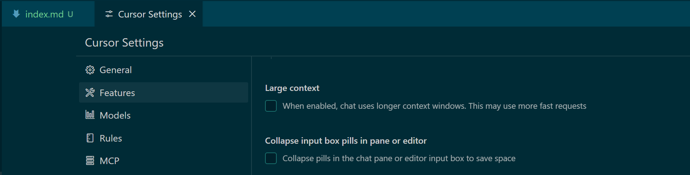

> https://docs.cursor.com/settings/models

## 可用模型

要将模型添加到 chat 和 ⌘K 选择菜单，请从 Cursor Settings > Models 中启用它。

| Model                                                        | Provider  | Premium | Agent | Price 6 |
| :----------------------------------------------------------- | :-------- | :-----: | :---: | :----- |
| [`claude-3.7-sonnet`](https://www.anthropic.com/claude/sonnet) | Anthropic |    ✓    |   ✓   | $0.04  |
| [`claude-3.7-sonnet`](https://www.anthropic.com/claude/sonnet) MAX 1 | Anthropic |         |   ✓   | $0.05  |
| [`claude-3.5-sonnet`](https://www.anthropic.com/claude/sonnet) | Anthropic |    ✓    |   ✓   | $0.04  |
| [`claude-3.5-haiku`](https://www.anthropic.com/claude/haiku) 2 | Anthropic |    ✓    |       | $0.01  |
| [`claude-3-opus`](https://www.anthropic.com/news/claude-3-family) 3 | Anthropic |    ✓    |       | $0.10  |
| `cursor-small`                                               | Cursor    |         |       | Free   |
| [`deepseek-v3`](https://www.deepseek.com/)                   | Fireworks |         |       | Free   |
| [`deepseek-r1`](https://www.deepseek.com/)                   | Fireworks |    ✓    |       | $0.04  |
| [`gemini-2.5-pro-exp`](https://blog.google/technology/google-deepmind/gemini-model-thinking-updates-march-2025/) | Google    |    ✓    |   ✓   | $0.04  |
| [`gemini-2.0-pro-exp`](https://blog.google/technology/google-deepmind/gemini-model-updates-february-2025/) | Google    |    ✓    |       | $0.04  |
| [`gpt-4o`](https://openai.com/index/hello-gpt-4o/)           | OpenAI    |    ✓    |   ✓   | $0.04  |
| [`gpt-4o-mini`](https://openai.com/gpt-4o-mini) 4            | OpenAI    |    ✓    |       | Free   |
| [`gpt-4.5-preview`](https://openai.com/index/introducing-gpt-4-5/) | OpenAI    |         |       | $2.00  |
| [`o1`](https://openai.com/index/learning-to-reason-with-llms/) | OpenAI    |         |       | $0.40  |
| [`o1-mini`](https://openai.com/index/openai-o1-mini-advancing-cost-efficient-reasoning/) 3 | OpenAI    |         |       | $0.10  |
| [`o3-mini`](https://openai.com/index/openai-o3-mini/) 2, 5   | OpenAI    |    ✓    |   ✓   | $0.01  |
| [`grok-2`](https://x.ai/blog/grok-1212)                      | xAI       |    ✓    |       | $0.04  |

表格中的批注内容：

1. 工具调用按请求收费
2. 按1/3请求计费
3. 付费计划每天包含10次请求
4. 免费计划每天500次请求
5. 需要高推理能力
6. 长上下文窗口请求的价格更高

### 高级模型

高级模型可以与每月 Pro 或 Business 订阅中包含的 500 个请求一起使用。

一旦您用完了每月 500 个请求，Cursor 将继续为您提供高级模型请求，但可能会延迟响应时间和/或在平台高负载时限制对某些模型的访问。

为了避免延迟和有限的访问，您可以从设置中为高级模型启用基于使用的定价，并在用完每月 500 的配额后按请求支付。

### 代理模型

代理模型可以与 chat 的代理模式一起使用。这些模型在进行工具调用方面能力很强，并且在 Agent 中表现最好。

提交一个包含最多 25 个工具调用的代理提示符将消耗一个请求。如果您的请求超过 25 个工具调用，Cursor 将询问您是否要继续，这将消耗第二个请求。

### 非高级模型

那些未指定为高级的型号是按需付费的，可以通过从设置启用基于使用的定价来使用。500 montly 请求不能用于这些模型。

### MAX

MAX 模式下提供的模型具有更大的上下文窗口和扩展推理的增强功能。

MAX 模式目前作为 Claude 3.7 Sonnet 的一个选项提供，它提供了一个 200k 的令牌上下文窗口，200 个代理工具调用限制，以及每个文件读取操作处理多达 750 行的能力。

当作为代理操作时，MAX 模式下的每个工具调用除了初始提示请求外，还作为单独的请求收费。

## 选择模型

chat 和 ⌘K 中的输入界面包括一个模型选择菜单，其中列出了从 Settings > Models 中启用的模型。

> 备注：chat 界面的设置如图，必须在开始 chat 之前才能设置。要更换模型，需要新开一个 chat。

> 备注：cmd + k 界面的设置如图，在 cmd + k 调出界面后就可以设置了。

### 自动选择

启用  Auto-select 可将 Cursor 配置为根据当前需求选择最适合当前任务并具有最高可靠性的高级型号。此功能可以检测输出性能下降，并自动切换模型以解决问题。

### Thinking

开启 thinking 将模型列表限制为推理模型，这些模型逐步思考问题，并具有更深层次的能力来检查自己的推理和纠正错误。

这些模型通常在复杂的推理任务上表现更好，尽管它们可能需要更多的时间来生成响应。

## 上下文窗口

上下文窗口是 LLM 可以同时考虑的文本和代码的最大跨度，包括输入提示和模型生成的输出。

Cursor 中的每个 chat 会话都维护自己的上下文窗口。会话中包含的提示、附加文件和响应越多，上下文窗口就越大。

随着聊天会话的进行，Cursor 会主动优化上下文窗口，智能地修剪非必要内容，同时保留关键代码和会话元素。

为获得最佳效果，建议您采用基于目的的聊天会话管理方法，为每个独特的任务启动一个新会话。

### 大上下文和定价

大上下文模式允许 Cursor 在每个会话中处理更多的文本和代码，处理更大的文件和复杂的任务，同时保持关键的上下文。

与标准上下文会话相比，使用大型上下文会使请求价格翻一番 。这种定价反映了处理和分析大量信息所需的计算资源增加。

可以通过两种方式启用大上下文：

- 通过从 Settings > Features 中检查 “Large context” 手动设置

  

- 当聊天会话变长和/或包含大型文件附件时自动执行;在这种情况下，输入界面中将显示一个图标来指示大型上下文费用

您可以从设置页面真实的监控每个请求的成本。

### 上下文窗口大小

| Mode                           | Context Window |
| :----------------------------- | :------------- |
| Agent: `claude-3.7-sonnet` MAX | 200,000 tokens |
| Agent: `claude-3.7-sonnet`     | 120,000 tokens |
| Agent: Other Models            | 60,000 tokens  |
| ⌘K                             | 10,000 tokens  |

随着 Cursor 进一步优化其上下文功能，这些阈值可能会发生变化。

## 模型托管

模型由模型的提供商、受信任的合作伙伴或 Cursor 托管在美国的基础设施上。

当从设置中启用隐私模式(Privacy Mode)时，cursor 或模型提供程序将存储您的数据，并在处理每个请求后删除所有数据。有关详细信息，请参阅我们的隐私 、 隐私政策和安全页面。

备注：在 cursor settings > general 中可以设置隐私模式。

