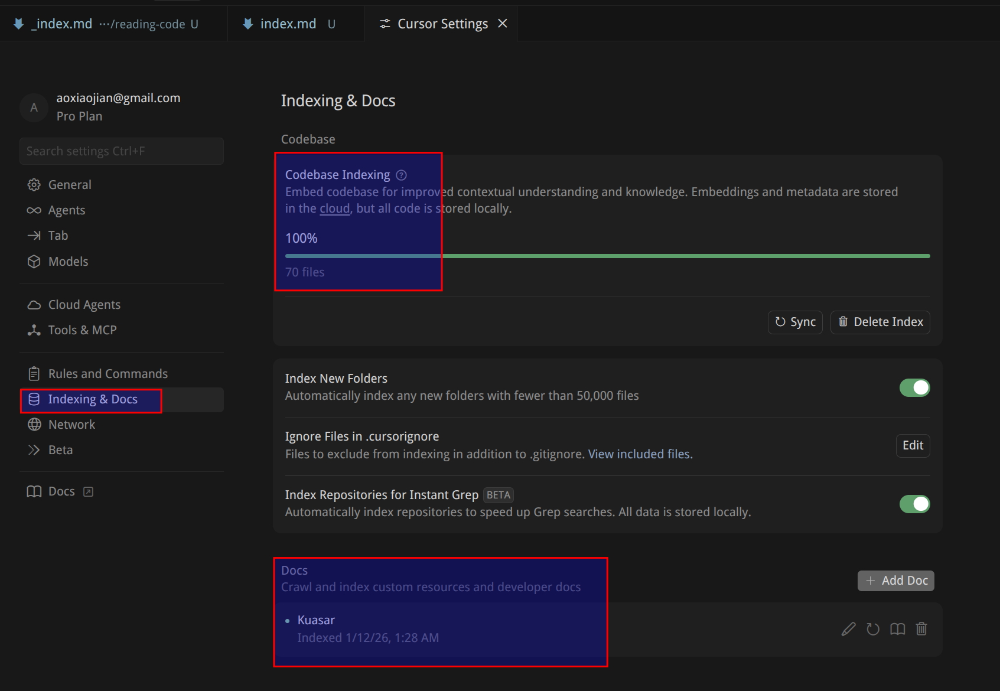

以 kuasar 项目为例，在操作之前我咨询了 gemini：

https://aistudio.google.com/prompts/1UbGg_jaBowBPP-cCiBSxZusiI4fkpPR5

## 准备工作

### 代码仓库

git clone kuasar 代码仓库到本地：

## cursor 设置

### Index和文档设置

使用 cursor 打开 kuasar 代码，然后打开 cursor 设置。

在 "Indexing & docs" 中，确保 codebase indexing 是 100%，然后在下方的 docs 中，添加 kuasar 官方文档地址： https://kuasar.io/docs/ 。同样等待 index 完成。

